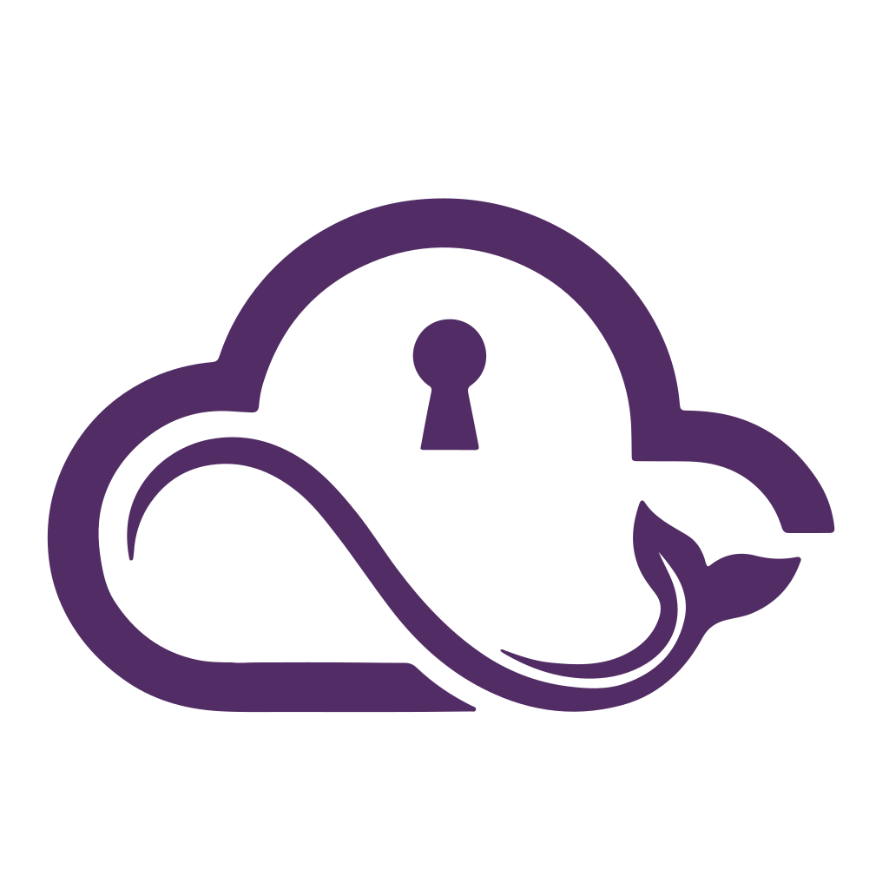

<p align="center">
  
</p>

<h1 align="center">MistLock</h1>

<p align="center"><strong>Catálogo de entornos de desarrollo Cloud automatizados.</strong><br>Sin cuentas, local-first y compatibles con AWS, Azure y GCP.</p>

<p align="center">
  <a href="https://www.linkedin.com/in/raulcastillabravo/">LinkedIn</a> · <a href="https://mistlock.dev">Docs</a>
</p>

---

**MistLock** es un catálogo de entornos de desarrollo Cloud que combina Docker, Dev Containers, emuladores y servicios Open Source para que puedas desarrollar localmente como si estuvieras en la nube, pero **100% gratis, sin cuentas y sin tarjeta de crédito**.

Usa estos entornos para aprender Cloud computing, iniciar tu proyecto o incorporarlos a uno existente.

El objetivo es que entiendas **cómo desarrollar localmente usando un servicio Cloud** — una vez que lo hagas, la mayoría de las veces solo necesitarás la nube para el despliegue.

> **Nota del autor**
>
> ¡Hola! Soy **Raúl Castilla**, el creador de **MistLock**, un proyecto que construyo en mi tiempo libre para ayudarte a desarrollar **sin miedo a las facturas de la nube**.
>
> Una ⭐ en **GitHub o apoyando mi contenido en redes sociales** me ayuda mucho a seguir expandiéndolo. Todo el apoyo es bienvenido 😊.
>
> ¡Muchas gracias y recuerda: **desarrollar es gratis**!

## Prerrequisitos

- [Docker](https://www.docker.com/get-started) instalado y en ejecución.
- [VS Code](https://code.visualstudio.com/) con la [extensión Dev Containers](vscode:extension/ms-vscode-remote.remote-containers) instalada *(opcional pero recomendado)*.

## Labs: MVEs vs Proyectos

Llamamos a cada ejemplo del catálogo un **Lab**, y hay dos tipos de Labs: MVEs (Minimal Viable Examples) y Proyectos:
- **MVE**: se centra en un **único** servicio Cloud — cómo emularlo y qué herramientas usar.
- **Proyectos**: combinan **múltiples** servicios Cloud en el mismo entorno local para mostrar cómo se integran en un flujo real.

## Cómo empezar

1. **Selecciona** un Lab desde el [catálogo](https://mistlock.dev/start-here/catalog/) o navegando por la barra lateral en la [documentación](https://mistlock.dev/start-here/getting-started/).

2. **Descarga** el código usando el botón de descarga en cada página de Lab o clonando el repositorio de GitHub.

3. **Abre** el Lab en tu IDE.

4. **Ejecuta** el Lab. Cada Lab tiene sus propias instrucciones, pero en general funciona así:

    - **Con Dev Container**

      Abre VS Code en la carpeta del Lab y ejecuta este comando en la **Command Palette** con `Ctrl+Shift+P`:
      ```bash
      Dev Containers: Reopen in Container
      ```
      Ejecuta el Lab:
      ```bash
      python main.py
      ```

    - **Sin Dev Container**

      Inicia la infraestructura:
      ```bash
      docker compose up -d
      ```
      Configura el entorno:
      ```bash
      ./scripts/setup.sh
      ```
      Ejecuta el Lab:
      ```bash
      python main.py
      ```

## ¿Necesitas ayuda?

**Escríbeme por LinkedIn** o **abre un issue en GitHub** si encuentras un bug o algo no está claro. 

¡Estaré encantado de ayudarte 😄!
