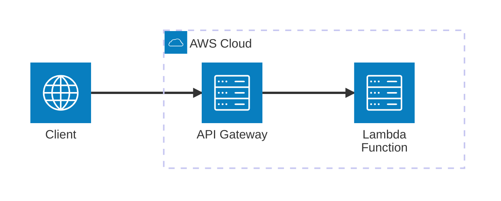

# AWS Lambda (SAM)

Minimal Viable Example to work with **AWS Lambda** using the **Serverless Application Model (SAM)** and **Python**. This example demonstrates how to build and run a local API Gateway and Lambda service for direct SDK invocation.

## Architecture


[](vscode:extension/mermaidchart.vscode-mermaid-chart)

## Index

- [Prerequisites](#prerequisites)
- [Quickstart](#quickstart)
- [Setup Environment](#setup-environment)
- [Start Infrastructure](#start-infrastructure)
- [How to execute](#how-to-execute)
- [How to debug](#how-to-debug)
- [How to test](#how-to-test)
- [Validate results](#validate-results)
- [Clean Up](#clean-up)

## Prerequisites

- [Docker](https://www.docker.com/get-started) installed and running.
- [SAM CLI](https://docs.aws.amazon.com/serverless-application-model/latest/developerguide/install-sam-cli.html) installed.

⚠️ **Limitations**: This MVE is **not compatible with Dev Containers** due to limitations in the SAM CLI when running inside a container.

## Quickstart

1. **Setup Environment**: Run the setup script to install tools and dependencies.
   ```bash
   scripts/setup.sh
   ```
2. **Start Infrastructure**: Launch both SAM local services (API Gateway and Lambda) in separate terminals.
   ```bash
   sam local start-api
   ```
   ```bash
   sam local start-lambda
   ```
3. **Run the Example**:
   ```bash
   python main.py
   ```

💡 **Next Steps**: See the [How to debug](#how-to-debug), [How to test](#how-to-test), [Validate results](#validate-results) and [Clean Up](#clean-up) sections below.

## Setup Environment

Set up the environment manually using the provided script:

```bash
scripts/setup.sh
```

## Start Infrastructure

The local infrastructure is managed by the SAM CLI. Start both services in separate terminals:

1. **API Gateway**: If you want to use HTTP requests or cURL:
   ```bash
   sam local start-api
   ```

2. **Lambda SDK**: If you want to use the AWS SDK (boto3) or AWS CLI:
   ```bash
   sam local start-lambda
   ```

## How to execute

1. **Using python**:
   - **Run**:
     ```bash
     python main.py
     ```

2. **Using cURL**:
   - **Run**:
     ```bash
     curl "http://127.0.0.1:3000/get_secret?username=admin"
     ```

3. **Using [REST Client](vscode:extension/humao.rest-client)**:
   - **Open**: `http/get_secret.http`.
   - **Run**: Click on **Send Request** above the URL.

4. **Using [AWS CLI](https://docs.aws.amazon.com/cli/latest/userguide/getting-started-install.html)**:
   - **Run** if you have AWS CLI installed globally:
     ```bash
     aws lambda invoke --function-name GetSecretFunction --profile sam --payload '{"queryStringParameters": {"username": "admin"}}' output.json
     ```
   - **Run** if you have AWS CLI installed via mise:
     ```bash
     mise exec -- aws lambda invoke --function-name GetSecretFunction --profile sam --payload '{"queryStringParameters": {"username": "admin"}}' output.json
     ```
   - **Verify** the output file `output.json`.

## How to debug

1. **main.py**:
   - **Open**: `main.py`.
   - **Breakpoints**: Set breakpoints in the code.
   - **Run SAM**: Start both local services: `sam local start-api` and `sam local start-lambda` in separate terminals.
   - **Run**: In the VS Code **Run and Debug** tab, select **Python: Main** and press `F5`.

2. **Lambda Function**:
   - **Open**: `src/functions/get_secret/app.py`.
   - **Breakpoints**: Set breakpoints in your Lambda handler.
   - **Run**: In the VS Code **Run and Debug** tab, select **SAM: Debug get_secret** and press `F5`.

## How to test

1. **Individually**: You can run tests individually from the VS Code **Testing** tab.

2. **All tests**: To execute all tests using the automated script:
   ```bash
   scripts/run_tests.sh
   ```

## Validate results

1. **Check logs from the terminal**:Verify that the Lambda function returns the expected secret values. In all cases, you can check the **logs** in the terminal where the SAM services are running.

2. **Check using AWS CLI**: Open the generated `output.json` and ensure it contains the expected status code and secret value.

## Clean Up

1. **Stop SAM local services**: Press `Ctrl+C` in the terminal where SAM is running.

2. **Remove tools and dependencies**: To remove the local virtual environment and prune mise tools:
   ```bash
   rm -rf .venv
   mise uninstall -a
   ```
