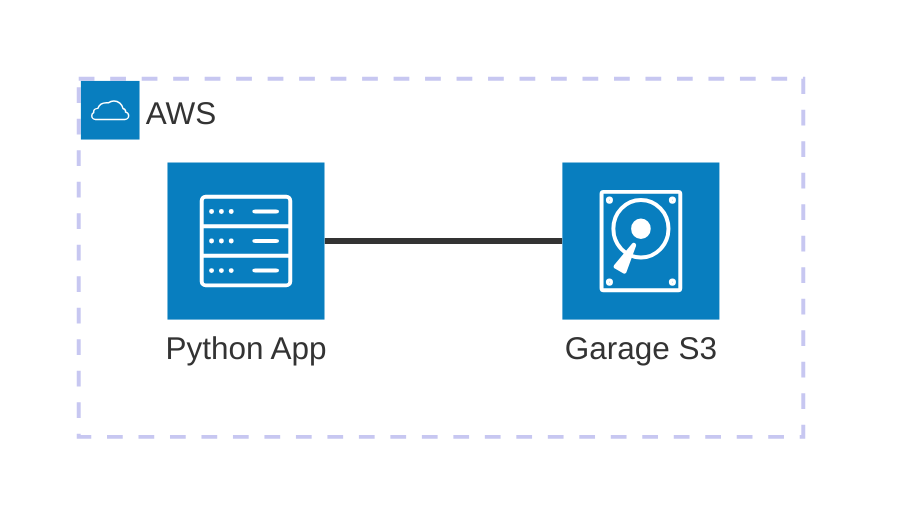

import { Steps } from '@astrojs/starlight/components';

Ejemplo mínimo viable para trabajar con **AWS S3** usando **Garage** como emulador local. Este ejemplo demuestra un pipeline de datos usando **Boto3**, **PyArrow** y **Delta Lake** (delta-rs).

## Arquitectura



[](vscode:extension/mermaidchart.vscode-mermaid-chart)

## Prerrequisitos

- [Docker](https://www.docker.com/get-started) instalado.
- Extensión [Dev Containers](vscode:extension/ms-vscode-remote.remote-containers) instalada.

:::tip[Quickstart con Dev Container]
Abre VS Code en la carpeta del proyecto y selecciona **Dev Containers: Reopen in Container**. El entorno y la infraestructura se inician automáticamente.
:::

:::note[Claves de Garage S3]
Las claves de conexión al S3 de Garage se refrescan automáticamente al iniciar o reiniciar el entorno de desarrollo. Usa las generadas en tu `.env`, no las del repositorio.
:::

## Cómo ejecutar

<Steps>

1. **Configurar el entorno**: Ejecuta el script de configuración para instalar las herramientas y dependencias.
   ```bash
   scripts/setup.sh
   ```
2. **Iniciar la infraestructura**: Lanza los contenedores necesarios.
   ```bash
   docker compose up -d
   ```
3. **Ejecutar el ejemplo**:
   ```bash
   python main.py
   ```

</Steps>

## Validar resultados

1. **Comprobar Buckets**: Verifica que se hayan creado los buckets `bronze` y `silver`.
   ```bash
   aws s3 ls --profile garage
   ```
2. **Comprobar Contenido**: Verifica los archivos en el bucket silver.
   ```bash
   aws s3 ls s3://silver --recursive --profile garage
   ```
3. **Explorar con Rclone (GUI)**: Levanta la interfaz gráfica de Rclone para explorar los archivos visualmente.
   ```bash
   scripts/rclone-gui.sh
   ```
   Navega a `http://127.0.0.1:5572` en tu navegador.

## Limpieza

```bash
docker compose down -v
```

## Solución de Problemas

| Problema | Solución |
|----------|----------|
| API de Garage no lista | Asegúrate de que el contenedor `garage` esté funcionando y espera unos segundos a que la API se inicialice. Revisa los logs con `docker logs garage`. |
| Puerto 3900 en uso | Detén cualquier otro servicio que use el puerto 3900 o cambia el mapeo en `docker-compose.yml`. |
