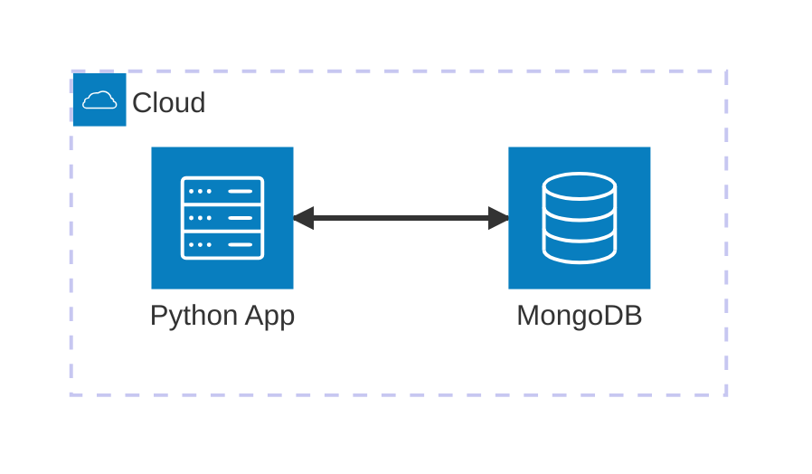

# MongoDB

Minimal Viable Example to work with **MongoDB** using **Python**, **Docker Compose**, and **MongoEngine ODM**. This example demonstrates basic CRUD operations and how to use different tools for execution and validation.

## Architecture


[](vscode:extension/mermaidchart.vscode-mermaid-chart)

## Index

- [Prerequisites](#prerequisites)
- [Quickstart](#quickstart)
- [Setup Environment](#setup-environment)
- [Start Infrastructure](#start-infrastructure)
- [How to execute](#how-to-execute)
- [How to debug](#how-to-debug)
- [How to test](#how-to-test)
- [Validate results](#validate-results)
- [Clean Up](#clean-up)

## Prerequisites

- [Docker](https://www.docker.com/get-started) installed and running.
- [Dev Containers extension](vscode:extension/ms-vscode-remote.remote-containers) installed.

## Quickstart

1. **Open in Container**: Open VS Code in the project folder and select **Dev Containers: Reopen in Container** from the Command Palette (`F1`).
2. **Run the Example**:
   ```bash
   python main.py
   ```

💡 **Next Steps**: See the [How to debug](#how-to-debug), [How to test](#how-to-test), [Validate results](#validate-results) and [Clean Up](#clean-up) sections below.

## Setup Environment

If you are not using a Dev Container, you can set up the environment manually:

```bash
scripts/setup.sh
```

## Start Infrastructure

If you are not using a Dev Container, launch the required containers:
```bash
docker compose up -d
```

## How to execute

1. **Using python**:
   ```bash
   python main.py
   ```

2. **Using mongosh**:
   - **Enter Shell**:

      ```bash
      scripts/mongosh.sh
      ```

   - **Copy**: Copy and paste the script from `playgrounds/users.mongodb.js` into the shell.

3. **Using [MongoDB for VS Code](vscode:extension/mongodb.mongodb-vscode)**:
   - **Connect**: Connect using the `MONGO_URI` defined in your `.env`.
   - **Open**: Open `playgrounds/users.mongodb.js`.
   - **Run**: Click the **Play** icon in the top right of the editor.

4. **Using [MongoDB Compass](https://www.mongodb.com/try/download/compass)**:
   - **Connect**: Connect using the `MONGO_URI` defined in your `.env`.
   - **Navigate**: Navigate to `my_db` -> `users`.
   - **Insert**: Click **Add Data** -> **Insert Document** to create a user manually.
   - **Mongosh**: Alternatively, open the **embedded Mongosh** and copy and paste the script from `playgrounds/users.mongodb.js`.

## How to debug

1. **main.py**:
   - **Open**: Open `main.py`.
   - **Breakpoints**: Set breakpoints in the code.
   - **Run**: Press `F5` to start debugging.

2. **Tests**:
   - **Open**: Open a test file (e.g., `tests/test_user.py`).
   - **Breakpoints**: Set breakpoints in the test code.
   - **Run**: Use the VS Code **Testing** tab and click the **Debug Test** icon next to the test you want to debug.

## How to test

1. **Individually**: You can run tests individually from the VS Code **Testing** tab.

2. **All tests**: To execute all tests (unit and integration) using the automated script:

   ```bash
   scripts/run_tests.sh
   ```

## Validate results

Verify that the user data is correctly stored in MongoDB.

1. **Check using mongosh**:
   - **Enter Shell**: Run the connection script:
     ```bash
     scripts/mongosh.sh
     ```
   - **Check Data**: Run the following query to see all users:
     ```javascript
     db.getSiblingDB('my_db').users.find().pretty()
     ```

2. **Check using [MongoDB for VS Code](vscode:extension/mongodb.mongodb-vscode)**:
   - **Connect**: Connect using the `MONGO_URI` defined in your `.env`.
   - **Verify**: Navigate to `my_db` -> `users`.
   - **Interactive**: You can use **Playgrounds** to run interactive queries.

3. **Check using [MongoDB Compass](https://www.mongodb.com/try/download/compass)**:
   - **Connect**: Connect using the `MONGO_URI` defined in your `.env`.
   - **Verify**: Navigate to `my_db` -> `users`.
   - **Interactive**: You can use **Mongosh** to run interactive queries.

## Clean Up

To stop all services and remove the state:
```bash
docker compose down -v
```
