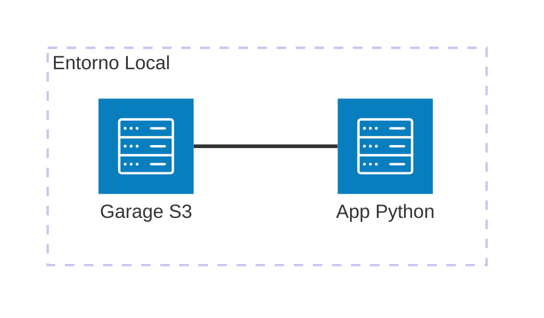

# AWS S3

Ejemplo mínimo viable para trabajar con **AWS S3** usando **Garage** como emulador local. Este ejemplo demuestra un pipeline de datos usando **Boto3**, **PyArrow** y **Delta Lake** (delta-rs).

## Arquitectura



[](vscode:extension/mermaidchart.vscode-mermaid-chart)

## Índice

- [Quickstart (Dev Container)](#quickstart-dev-container)
- [Paso a Paso (sin Dev Container)](#paso-a-paso-sin-dev-container)
- [Validación](#validación)
- [Limpieza](#limpieza)
- [Solución de Problemas](#solución-de-problemas)
- [Licencia](#licencia)

## Quickstart (Dev Container)

### Prerrequisitos

- [Docker](https://www.docker.com/get-started) instalado.
- Extensión [Dev Containers](vscode:extension/ms-vscode-remote.remote-containers) instalada.

### Pasos

1. **Abrir en Contenedor**: Abre VS Code en la carpeta del proyecto y selecciona **Dev Containers: Reopen in Container** desde la Paleta de Comandos (`F1`).
2. **Ejecutar el Ejemplo**:
   ```bash
   python main.py
   ```

💡 **Próximos Pasos**: Consulta las secciones de [Validación](#validación) y [Limpieza](#limpieza) a continuación.

## Paso a Paso (sin Dev Container)

### 1. Iniciar Infraestructura
Lanza los contenedores necesarios:
```bash
docker compose up -d
```

### 2. Configurar el Entorno
Instala las dependencias y herramientas del sistema usando mise:
```bash
scripts/setup.sh
```

### 3. Inicializar Garage
El script de configuración ya maneja esto, pero puedes ejecutar las tareas individualmente si es necesario:
```bash
mise run setup
```

### 4. Ejecutar el Ejemplo
Ejecuta el script de demostración:
```bash
python main.py
```

## Validación

Explica cómo verificar que el ejemplo funciona correctamente.

1. **Verificar Buckets**: Comprueba que los buckets `bronze` y `silver` fueron creados.
   ```bash
   aws s3 ls --profile garage --endpoint-url http://localhost:3900
   ```
2. **Verificar Tabla Delta**: Comprueba los archivos en el bucket silver.
   ```bash
   aws s3 ls s3://silver/products_delta/ --recursive --profile garage --endpoint-url http://localhost:3900
   ```

### Detalles de Conexión
- **Endpoint**: `http://localhost:3900`
- **Región**: `garage`
- **Perfil**: `garage`
- **Buckets**: `bronze`, `silver`

## Limpieza

Para detener todos los servicios y eliminar el estado:
```bash
docker compose down -v
```

## Solución de Problemas

| Problema | Solución |
|----------|----------|
| API de Garage no lista | Asegúrate de que el contenedor `garage` esté funcionando y espera unos segundos a que la API se inicialice. Revisa los logs con `docker logs garage`. |
| Puerto 3900 en uso | Detén cualquier otro servicio que use el puerto 3900 o cambia el mapeo en `docker-compose.yml`. |

## Licencia

Este es un ejemplo mínimo para fines educativos. Siéntete libre de usarlo y modificarlo según sea necesario.
