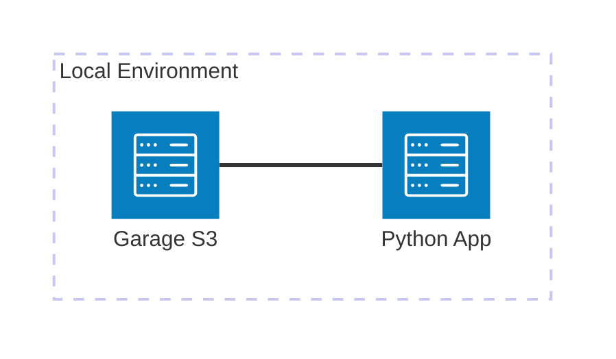

# AWS S3

Minimal viable example to work with **AWS S3** using **Garage** as a local emulator. This example demonstrates a data pipeline using **Boto3**, **PyArrow**, and **Delta Lake** (delta-rs).

## Architecture



[](vscode:extension/mermaidchart.vscode-mermaid-chart)

## Index

- [Quickstart (Dev Container)](#quickstart-dev-container)
- [Step by Step (without Dev Container)](#step-by-step-without-dev-container)
- [Validation](#validation)
- [Clean Up](#clean-up)
- [Troubleshooting](#troubleshooting)
- [License](#license)

## Quickstart (Dev Container)

### Prerequisites

- [Docker](https://www.docker.com/get-started) installed.
- [Dev Containers extension](vscode:extension/ms-vscode-remote.remote-containers) installed.

### Steps

1. **Open in Container**: Open VS Code in the project folder and select **Dev Containers: Reopen in Container** from the Command Palette (`F1`).
2. **Run the Example**:
   ```bash
   python main.py
   ```

💡 **Next Steps**: See the [Validation](#validation) and [Clean Up](#clean-up) sections below.

## Step by Step (without Dev Container)

### 1. Start Infrastructure
Launch the required containers:
```bash
docker compose up -d
```

### 2. Setup Environment
Install dependencies and system tools using mise:
```bash
scripts/setup.sh
```

### 3. Initialize Garage
The setup script already handles this, but you can run the tasks individually if needed:
```bash
mise run setup
```

### 4. Run Example
Execute the demonstration script:
```bash
python main.py
```

## Validation

Explain how to verify the example is working correctly.

1. **Check Buckets**: Verify that `bronze` and `silver` buckets were created.
   ```bash
   aws s3 ls --profile garage --endpoint-url http://localhost:3900
   ```
2. **Check Delta Table**: Verify the files in the silver bucket.
   ```bash
   aws s3 ls s3://silver/products_delta/ --recursive --profile garage --endpoint-url http://localhost:3900
   ```

### Connection Details
- **Endpoint**: `http://localhost:3900`
- **Region**: `garage`
- **Profile**: `garage`
- **Buckets**: `bronze`, `silver`

## Clean Up

To stop all services and remove the state:
```bash
docker compose down -v
```

## Troubleshooting

| Issue | Solution |
|-------|----------|
| Garage API not ready | Ensure the `garage` container is running and wait a few seconds for the API to initialize. Check logs with `docker logs garage`. |
| Port 3900 in use | Stop any other service using port 3900 or change the mapping in `docker-compose.yml`. |

## License

This is a minimal example for educational purposes. Feel free to use and modify as needed.
