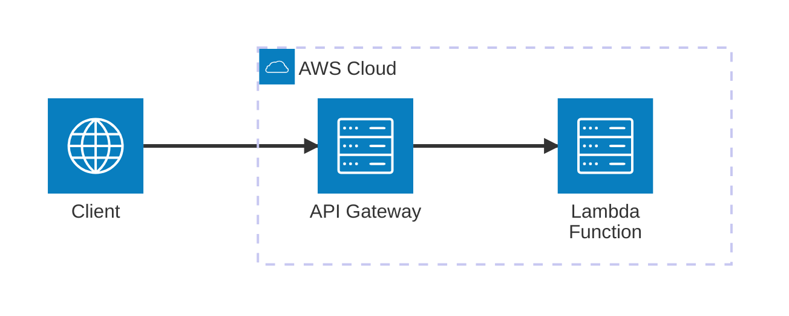

# AWS Lambda (SAM)

Ejemplo Mínimo Viable (MVE) para trabajar con **AWS Lambda** utilizando el **Serverless Application Model (SAM)** y **Python**. Este ejemplo demuestra cómo construir y ejecutar un API Gateway local con funciones Lambda.

## Arquitectura


[](vscode:extension/mermaidchart.vscode-mermaid-chart)

## Índice

- [Limitaciones](#limitaciones)
- [Requisitos previos](#requisitos-previos)
- [Inicio rápido](#inicio-rápido)
- [Configurar entorno](#configurar-entorno)
- [Iniciar infraestructura](#iniciar-infraestructura)
- [Cómo ejecutar](#cómo-ejecutar)
- [Cómo depurar](#cómo-depurar)
- [Cómo probar](#cómo-probar)
- [Validar resultados](#validar-resultados)
- [Limpieza](#limpieza)

## Limitaciones

⚠️ **Compatibilidad con Dev Containers**: Este MVE **no es compatible con Dev Containers**. Esto se debe a las limitaciones del CLI de SAM al ejecutarse dentro de un contenedor, lo que impide un mapeo de rutas y una red correctos para la ejecución local de Lambda.

## Requisitos previos

- [Docker](https://www.docker.com/get-started) instalado y en ejecución.
- [SAM CLI](https://docs.aws.amazon.com/serverless-application-model/latest/developerguide/install-sam-cli.html) instalado.

## Inicio rápido

1. **Configurar entorno**: Ejecuta el script de configuración para instalar herramientas y dependencias.
   ```bash
   scripts/setup.sh
   ```
2. **Iniciar la API**: Inicia el API Gateway local de SAM.
   ```bash
   sam local start-api
   ```
3. **Ejecutar el Ejemplo**: Ejecuta el script de Python para probar la API.
   ```bash
   python main.py
   ```

## Configurar entorno

Configura el entorno manualmente utilizando el script proporcionado:

```bash
scripts/setup.sh
```

La infraestructura local es gestionada por el CLI de SAM. 

1. **API Gateway**: Inicia el API Gateway local usando:
   ```bash
   sam local start-api
   ```

2. **SDK de Lambda**: Si vas a usar el SDK de AWS (boto3), inicia el servicio de Lambda local:
   ```bash
   sam local start-lambda
   ```

> [!NOTE]
> Los contenedores reales de Lambda son levantados dinámicamente por el CLI de SAM usando Docker cuando se reciben peticiones.

## Cómo ejecutar

1. **Usando python**:
   - **Ejecutar**:
     ```bash
     python main.py
     ```

2. **Usando cURL**:
   - **Ejecutar**:
     ```bash
     curl "http://127.0.0.1:3000/get_secret?username=admin"
     ```

3. **Usando [REST Client](vscode:extension/humao.rest-client)**:
   - **Abrir**: `http/get_secret.http`.
   - **Ejecutar**: Haz clic en **Send Request** encima de la URL.

4. **Usando AWS CLI**:
   - **Iniciar Lambda**:
     Usa `start-lambda` en lugar de `start-api` para ejecutar solo la función Lambda, sin API Gateway.
     ```bash
     sam local start-lambda
     ```
   - **Invocar**:
     ```bash
     aws lambda invoke --function-name GetSecretFunction --profile sam --payload '{"queryStringParameters": {"username": "admin"}}' output.json
     ```

## Cómo depurar

1. **main.py**:
   - **Abrir**: `main.py`.
   - **Breakpoints**: Añade puntos de interrupción en el código.
   - **Iniciar SAM**: Inicia la API local: `sam local start-api`.
   - **Ejecutar**: En la pestaña **Run and Debug** de VS Code, selecciona **Python: Main** y pulsa `F5`.

2. **Lambda Function**:
   - **Abrir**: `src/functions/get_secret/app.py`.
   - **Breakpoints**: Añade puntos de interrupción en tu controlador Lambda.
   - **Ejecutar**: En la pestaña **Run and Debug** de VS Code, selecciona **SAM: Debug get_secret** y pulsa `F5`.

## Cómo probar

1. **Todas las pruebas**: Ejecuta todas las pruebas usando el script automatizado:
   ```bash
   scripts/run_tests.sh
   ```

## Validar resultados

Verifica que la función Lambda devuelva los valores de secreto esperados basados en el nombre de usuario.

1. **Comprobar usando Python**:
   - **Ejecutar**: `python main.py`.
   - **Verificar**: La salida debería mostrar un estado `200` para `admin` y `403` para `guest`.

2. **Comprobar usando cURL**:
   - **Ejecutar**: `curl "http://127.0.0.1:3000/get_secret?username=admin"`.
   - **Verificar**: Asegúrate de que devuelva `"super-secret-value-from-emulator"`.

## Limpieza

Para detener la API local de SAM:

- **Ejecutar**: Pulsa `Ctrl+C` en la terminal donde se está ejecutando SAM.
