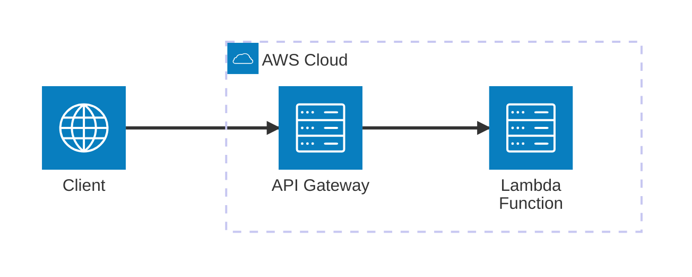

# AWS Lambda (SAM)

Ejemplo Mínimo Viable (MVE) para trabajar con **AWS Lambda** utilizando el **Serverless Application Model (SAM)** y **Python**. Este ejemplo demuestra cómo construir y ejecutar un API Gateway local y el servicio Lambda para invocación directa mediante el SDK.

## Arquitectura


[](vscode:extension/mermaidchart.vscode-mermaid-chart)

## Índice

- [Requisitos previos](#requisitos-previos)
- [Inicio rápido](#inicio-rápido)
- [Configurar entorno](#configurar-entorno)
- [Iniciar infraestructura](#iniciar-infraestructura)
- [Cómo ejecutar](#cómo-ejecutar)
- [Cómo depurar](#cómo-depurar)
- [Cómo probar](#cómo-probar)
- [Validar resultados](#validar-resultados)
- [Limpieza](#limpieza)

## Requisitos previos

- [Docker](https://www.docker.com/get-started) instalado y en ejecución.
- [SAM CLI](https://docs.aws.amazon.com/serverless-application-model/latest/developerguide/install-sam-cli.html) instalado.

⚠️ **Limitaciones**: Este MVE **no es compatible con Dev Containers** debido a las limitaciones del CLI de SAM al ejecutarse dentro de un contenedor.

## Inicio rápido

1. **Configurar entorno**: Ejecuta el script de configuración para instalar herramientas y dependencias.
   ```bash
   scripts/setup.sh
   ```
2. **Iniciar infraestructura**: Inicia ambos servicios locales de SAM (API Gateway y Lambda) en terminales separadas.
   ```bash
   sam local start-api
   ```
   ```bash
   sam local start-lambda
   ```
3. **Ejecutar el Ejemplo**:
   ```bash
   python main.py
   ```

💡 **Siguientes pasos**: Consulta las secciones de [Cómo depurar](#cómo-depurar), [Cómo probar](#cómo-probar), [Validar resultados](#validar-resultados) y [Limpieza](#limpieza) a continuación.

## Configurar entorno

Configura el entorno manualmente utilizando el script proporcionado:

```bash
scripts/setup.sh
```

## Iniciar infraestructura

La infraestructura local es gestionada por el CLI de SAM. Inicia ambos servicios en terminales separadas:

1. **API Gateway**: Si deseas usar peticiones HTTP o cURL:
   ```bash
   sam local start-api
   ```

2. **SDK de Lambda**: Si deseas usar el SDK de AWS (boto3) o la AWS CLI:
   ```bash
   sam local start-lambda
   ```

## Cómo ejecutar

1. **Usando python**:
   - **Ejecutar**:
     ```bash
     python main.py
     ```

2. **Usando cURL**:
   - **Ejecutar**:
     ```bash
     curl "http://127.0.0.1:3000/get_secret?username=admin"
     ```

3. **Usando [REST Client](vscode:extension/humao.rest-client)**:
   - **Abrir**: `http/get_secret.http`.
   - **Ejecutar**: Haz clic en **Send Request** sobre la URL.

4. **Usando [AWS CLI](https://docs.aws.amazon.com/cli/latest/userguide/getting-started-install.html)**:
   - **Ejecutar** si tienes AWS CLI instalado globalmente:
     ```bash
     aws lambda invoke --function-name GetSecretFunction --profile sam --payload '{"queryStringParameters": {"username": "admin"}}' output.json
     ```
   - **Ejecutar** si tienes AWS CLI instalado a través de mise:
     ```bash
     mise exec -- aws lambda invoke --function-name GetSecretFunction --profile sam --payload '{"queryStringParameters": {"username": "admin"}}' output.json
     ```
   - **Verificar** el archivo de salida `output.json`.

## Cómo depurar

1. **main.py**:
   - **Abrir**: `main.py`.
   - **Puntos de interrupción**: Añade puntos de interrupción en el código.
   - **Iniciar SAM**: Inicia ambos servicios locales: `sam local start-api` y `sam local start-lambda` en terminales separadas.
   - **Ejecutar**: En la pestaña **Run and Debug** de VS Code, selecciona **Python: Main** y pulsa `F5`.

2. **Función Lambda**:
   - **Abrir**: `src/functions/get_secret/app.py`.
   - **Puntos de interrupción**: Añade puntos de interrupción en tu controlador Lambda.
   - **Ejecutar**: En la pestaña **Run and Debug** de VS Code, selecciona **SAM: Debug get_secret** y pulsa `F5`.

## Cómo probar

1. **Individualmente**: Puedes ejecutar las pruebas individualmente desde la pestaña **Testing** de VS Code.

2. **Todas las pruebas**: Para ejecutar todas las pruebas utilizando el script automatizado:
   ```bash
   scripts/run_tests.sh
   ```

## Validar resultados

1. **Comprobar logs desde la terminal**: Verifica que la función Lambda devuelva los valores de secreto esperados. En todos los casos, puedes consultar los **logs** en la terminal donde se están ejecutando los servicios de SAM.

2. **Comprobar usando AWS CLI**: Abre el archivo `output.json` generado y asegúrate de que contenga el código de estado y el valor del secreto esperados.

## Limpieza

1. **Detener servicios locales de SAM**: Pulsa `Ctrl+C` en la terminal donde se está ejecutando SAM.

2. **Eliminar herramientas y dependencias**: Para eliminar el entorno virtual local y limpiar las herramientas de mise:
   ```bash
   rm -rf .venv
   mise uninstall -a
   ```
