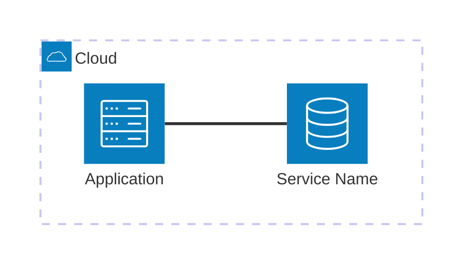

# [Project Title]

Minimal viable example to work with **[Service Name]** using **[Technologies]**. This example demonstrates [purpose of the MVE].

## Architecture



[](vscode:extension/mermaidchart.vscode-mermaid-chart)

## Index

- [Prerequisites](#prerequisites)
- [Quickstart](#quickstart)
- [Setup Environment](#setup-environment)
- [Start Infrastructure](#start-infrastructure)
- [How to execute](#how-to-execute)
- [How to debug](#how-to-debug)
- [How to test](#how-to-test)
- [Validate results](#validate-results)
- [Clean Up](#clean-up)

## Prerequisites

- [Docker](https://www.docker.com/get-started) installed and running.
- [Dev Containers extension](vscode:extension/ms-vscode-remote.remote-containers) installed.

## Quickstart

1. **Open in Container**: Open VS Code in the project folder and select **Dev Containers: Reopen in Container** from the Command Palette (`F1`).
2. **Run the Example**:
   ```bash
   python main.py
   ```

💡 **Next Steps**: See the [How to debug](#how-to-debug), [How to test](#how-to-test), [Validate results](#validate-results) and [Clean Up](#clean-up) sections below.

## Setup Environment

Install dependencies and system tools using mise:
```bash
scripts/setup.sh
```

## Start Infrastructure

Launch the required containers:
```bash
docker compose up -d
```

## How to execute

### Using python

Execute the demonstration script:
```bash
python main.py
```

## How to debug

### The main.py client

1. Open `main.py`.
2. Set breakpoints in the code.
3. Press `F5` to start debugging.

## How to test

### All tests

Execute the automated test suite:
```bash
scripts/run_tests.sh
```

## Validate results

Explain how to verify the example is working correctly.

1. **[Verification Step 1]**: Instructions.
2. **[Verification Step 2]**: Instructions.

### Connection Details
- **Server**: `localhost`
- **Port**: `[port]`
- **Username**: `[user]`
- **Password**: `[password]`

## Clean Up

To stop all services and remove the state:
```bash
docker compose down -v
```
