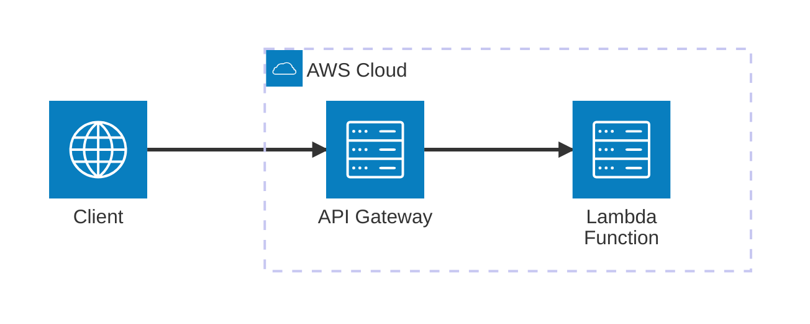

# AWS Lambda (SAM)

Minimal Viable Example to work with **AWS Lambda** using the **Serverless Application Model (SAM)** and **Python**. This example demonstrates how to build and run a local API Gateway with Lambda functions.

## Architecture



[](vscode:extension/mermaidchart.vscode-mermaid-chart)

## Index

- [Limitations](#limitations)
- [Prerequisites](#prerequisites)
- [Quickstart](#quickstart)
- [Setup Environment](#setup-environment)
- [Start Infrastructure](#start-infrastructure)
- [How to execute](#how-to-execute)
- [How to debug](#how-to-debug)
- [How to test](#how-to-test)
- [Validate results](#validate-results)
- [Clean Up](#clean-up)

## Limitations

⚠️ **Dev Container Compatibility**: This MVE is **not compatible with Dev Containers**. This is due to limitations in the SAM CLI when running inside a container.

## Prerequisites

- [Docker](https://www.docker.com/get-started) installed and running.
- [SAM CLI](https://docs.aws.amazon.com/serverless-application-model/latest/developerguide/install-sam-cli.html) installed.

## Quickstart

1. **Setup Environment**: Run the setup script to install tools and dependencies.
   ```bash
   scripts/setup.sh
   ```
2. **Start the API**: Boot up the local SAM API Gateway.
   ```bash
   sam local start-api
   ```
3. **Run the Example**: Execute the Python script to test the API.
   ```bash
   python main.py
   ```

## Setup Environment

Set up the environment manually using the provided script:

```bash
scripts/setup.sh
```

## Start Infrastructure

The local infrastructure is managed by the SAM CLI. Start the local API Gateway using:

```bash
sam local start-api
```

## How to execute

1. **Using python**:
   - **Run**:
     ```bash
     python main.py
     ```

2. **Using cURL**:
   - **Run**:
     ```bash
     curl "http://127.0.0.1:3000/get_secret?username=admin"
     ```

3. **Using [REST Client](vscode:extension/humao.rest-client)**:
   - **Open**: `http/get_secret.http`.
   - **Run**: Click on **Send Request** above the URL.

4. **Using AWS CLI**:
   - **Start Lambda**: Use `start-lambda` instead of `start-api` to run only the lambda function, without API Gateway.
     ```bash
     sam local start-lambda
     ```
   - **Invoke**:
     ```bash
     aws lambda invoke --function-name GetSecretFunction --profile sam --payload '{"queryStringParameters": {"username": "admin"}}' output.json
     ```

## How to debug

1. **main.py**:
   - **Open**: `main.py`.
   - **Breakpoints**: Set breakpoints in the code.
   - **Run SAM**: Start the local API: `sam local start-api`.
   - **Run**: In the VS Code **Run and Debug** tab, select **Python: Main** and press `F5`.

2. **Lambda Function**:
   - **Open**: `src/functions/get_secret/app.py`.
   - **Breakpoints**: Set breakpoints in your Lambda handler.
   - **Run**: In the VS Code **Run and Debug** tab, select **SAM: Debug get_secret** and press `F5`.

## How to test

1. **All tests**: Execute all tests using the automated script:
   ```bash
   scripts/run_tests.sh
   ```

## Validate results

Verify that the Lambda function returns the expected secret values based on the username.

1. **Check using Python**:
   - **Run**: `python main.py`.
   - **Verify**: The output should show a `200` status for `admin` and `403` for `guest`.

2. **Check using cURL**:
   - **Run**: `curl "http://127.0.0.1:3000/get_secret?username=admin"`.
   - **Verify**: Ensure it returns `"super-secret-value-from-emulator"`.

## Clean Up

To stop the SAM local API:

- **Run**: Press `Ctrl+C` in the terminal where SAM is running.
