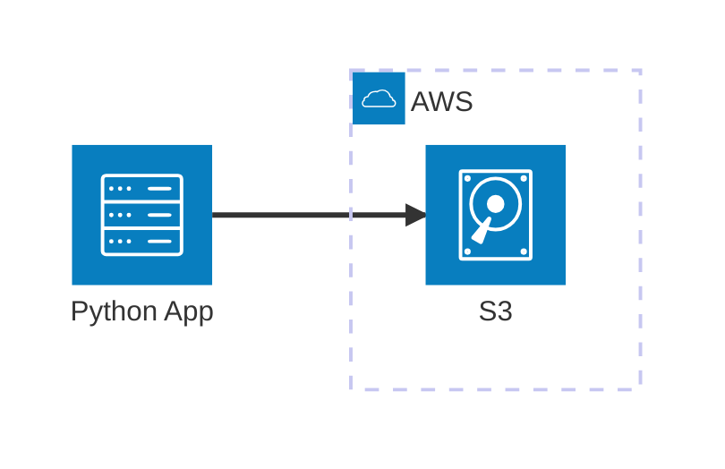

# AWS S3 (MinIO)

MVE emulando S3 con MinIO para pipelines de datos en local. Este ejemplo demuestra cómo integrar `boto3`, `pyarrow` (S3FileSystem) y `deltalake` con una instancia local de MinIO.

## Arquitectura

## Índice

- [Requisitos previos](#requisitos-previos)
- [Inicio rápido](#inicio-rápido)
- [Configurar entorno](#configurar-entorno)
- [Iniciar infraestructura](#iniciar-infraestructura)
- [Cómo ejecutar](#cómo-ejecutar)
- [Cómo depurar](#cómo-depurar)
- [Cómo testear](#cómo-testear)
- [Validar resultados](#validar-resultados)
- [Limpiar](#limpiar)

## Requisitos previos

- [Docker](https://www.docker.com/get-started)
- [Extensión Dev Containers](vscode:extension/ms-vscode-remote.remote-containers)

## Inicio rápido

1. **Abrir en Contenedor**: Abre VS Code en la carpeta del proyecto y selecciona **Dev Containers: Reopen in Container**.
2. **Ejecutar el Ejemplo**: Ejecuta `python main.py`.

## Configurar entorno

Si no estás usando un Dev Container, puedes configurar el entorno manualmente:
`scripts/setup.sh`

## Iniciar infraestructura

Si no estás usando un Dev Container, lanza los contenedores necesarios:
`docker compose up -d`

## Cómo ejecutar

1. **Usando python**:
   - **Ejecutar**: `scripts/run_main.sh`
2. **Usando AWS CLI**:
   - **Ejecutar**: `aws s3 ls`
3. **Usando MinIO CLI**:
   - **Ejecutar**: `scripts/minio_cli.sh ls myminio`

## Cómo depurar

1. **main.py**:
   - **Abrir**: `main.py`
   - **Puntos de interrupción**: Coloca los puntos de interrupción donde sea necesario.
   - **Ejecutar**: Usa el depurador estándar de Python en VS Code.
2. **Tests**:
   - **Abrir**: `tests/`
   - **Puntos de interrupción**: Coloca los puntos de interrupción donde sea necesario.
   - **Ejecutar**: Usa la pestaña de Testing de VS Code para depurar tests individuales.

## Cómo testear

1. **Individualmente**: A través de la pestaña Testing de VS Code.
2. **Todos los tests**: A través del script automatizado (`scripts/run_tests.sh`).

## Validar resultados

1. **Comprobar usando MinIO GUI**:
   - **Abrir**: `http://localhost:9001`
   - **Credenciales**: Usa `MINIO_ROOT_USER` y `MINIO_ROOT_PASSWORD` definidos en tu `.env`.
   - **Verificar**: Revisa los buckets `bronze` y `silver`.
2. **Comprobar usando AWS Toolkit**:
   - **Abrir**: Extensión AWS Toolkit en VS Code.
   - **Credenciales**: Usa `S3_ACCESS_KEY` y `S3_SECRET_KEY` definidos en tu `.env`.
   - **Verificar**: Explora los buckets de S3.

## Limpiar

Detener los servicios y eliminar los volúmenes:
`docker compose down -v`
