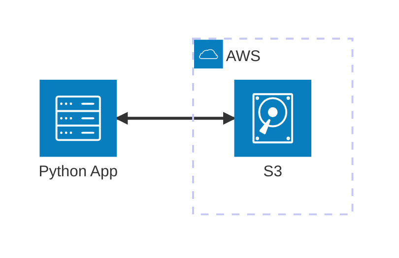

# S3 MinIO

Ejemplo Mínimo Viable (MVE) para trabajar con **AWS S3** en local usando **MinIO**, **Python** y varias librerías de S3 (**Boto3**, **Pyarrow** y **Deltalake**). Este ejemplo demuestra cómo integrar estas herramientas para pipelines de datos locales y emulación de almacenamiento de objetos.

## Arquitectura


[](vscode:extension/mermaidchart.vscode-mermaid-chart)

## Índice

- [Requisitos previos](#requisitos-previos)
- [Inicio rápido](#inicio-rápido)
- [Configurar entorno](#configurar-entorno)
- [Iniciar infraestructura](#iniciar-infraestructura)
- [Cómo ejecutar](#cómo-ejecutar)
- [Cómo depurar](#cómo-depurar)
- [Cómo testear](#cómo-testear)
- [Validar resultados](#validar-resultados)
- [Limpiar](#limpiar)

## Requisitos previos

- [Docker](https://www.docker.com/get-started) instalado y ejecutándose.
- [Extensión Dev Containers](vscode:extension/ms-vscode-remote.remote-containers) instalada.

## Inicio rápido

1. **Abrir en Contenedor**: Abre VS Code en la carpeta del proyecto y selecciona **Dev Containers: Reopen in Container** desde la Paleta de Comandos (`F1`).
2. **Ejecutar el Ejemplo**:
   ```bash
   python main.py
   ```

💡 **Siguientes pasos**: Consulta las secciones [Cómo depurar](#cómo-depurar), [Cómo testear](#cómo-testear), [Validar resultados](#validar-resultados) y [Limpiar](#limpiar) a continuación.

## Configurar entorno

Si no estás usando un Dev Container, puedes configurar el entorno manualmente:

```bash
scripts/setup.sh
```

## Iniciar infraestructura

Si no estás usando un Dev Container, lanza los contenedores necesarios:

```bash
docker compose up -d
```

## Cómo ejecutar

1. **Usando python**:
   ```bash
   python main.py
   ```

2. **Usando AWS CLI**:
   - **Subir**: Usa el siguiente comando para subir el archivo README al bucket bronze:
     ```bash
     aws s3 cp README.md s3://bronze --profile minio
     ```

## Cómo depurar

1. **main.py**:
   - **Abrir**: Abre `main.py`.
   - **Puntos de interrupción**: Establece puntos de interrupción en el código.
   - **Ejecutar**: Presiona `F5` para iniciar la depuración.

2. **Tests**:
   - **Abrir**: Abre un archivo de test (ej. `tests/components/test_s3_boto.py`).
   - **Puntos de interrupción**: Establece puntos de interrupción en el código del test.
   - **Ejecutar**: Usa la pestaña **Testing** de VS Code y haz clic en el icono **Debug Test** junto al test que quieras depurar.

## Cómo testear

1. **Individualmente**: Puedes ejecutar tests individualmente desde la pestaña **Testing** de VS Code.

2. **Todos los tests**: Para ejecutar todos los tests (incluyendo tests de componentes e integración) usando el script automatizado:

   ```bash
   scripts/run_tests.sh
   ```

## Validar resultados

1. **Comprobar usando MinIO GUI**:
   - **Abrir**: 
     ```bash
     http://localhost:9001
     ```
   - **Credenciales**: Usa el `MINIO_ROOT_USER` y `MINIO_ROOT_PASSWORD` definidos en tu `.env`.
   - **Verificar**: Revisa los buckets `bronze` y `silver` para ver los archivos subidos.

2. **Comprobar usando AWS CLI**:
   - **Ejecutar**: Lista el contenido del bucket bronze:
     ```bash
     aws s3 ls s3://bronze --recursive
     ```

3. **Comprobar usando MinIO CLI**:
   - **Entrar a la Shell**: 
     ```bash
     scripts/minio_cli.sh
     ```
   - **Verificar**: 
     ```bash
     mc ls data/bronze/ --recursive
     ```


## Limpiar

Para detener todos los servicios y eliminar el estado:

```bash
docker compose down -v
```
