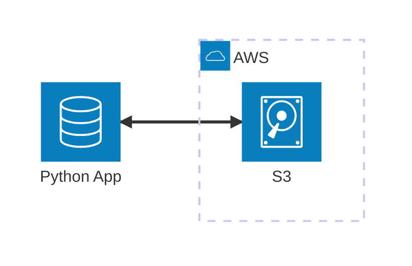

# S3 MinIO

Minimal Viable Example to work with **AWS S3** locally using **MinIO**, **Python**, and various S3 libraries (**Boto3**, **Pyarrow**, and **Deltalake**). This example demonstrates how to integrate these tools for local data pipelines and object storage emulation.

## Architecture


[](vscode:extension/mermaidchart.vscode-mermaid-chart)

## Index

- [Prerequisites](#prerequisites)
- [Quickstart](#quickstart)
- [Setup Environment](#setup-environment)
- [Start Infrastructure](#start-infrastructure)
- [How to execute](#how-to-execute)
- [How to debug](#how-to-debug)
- [How to test](#how-to-test)
- [Validate results](#validate-results)
- [Clean Up](#clean-up)

## Prerequisites

- [Docker](https://www.docker.com/get-started) installed and running.
- [Dev Containers extension](vscode:extension/ms-vscode-remote.remote-containers) installed.

## Quickstart

1. **Open in Container**: Open VS Code in the project folder and select **Dev Containers: Reopen in Container** from the Command Palette (`F1`).
2. **Run the Example**:
   ```bash
   python main.py
   ```

💡 **Next Steps**: See the [How to debug](#how-to-debug), [How to test](#how-to-test), [Validate results](#validate-results) and [Clean Up](#clean-up) sections below.

## Setup Environment

If you are not using a Dev Container, you can set up the environment manually:

```bash
scripts/setup.sh
```

## Start Infrastructure

If you are not using a Dev Container, launch the required containers:

```bash
docker compose up -d
```

## How to execute

1. **Using python**:
   ```bash
   python main.py
   ```

2. **Using AWS CLI**:
   - **Upload**: Use the following command to upload the README file to the bronze bucket:
     ```bash
     aws s3 cp README.md s3://bronze --profile minio
     ```

## How to debug

1. **main.py**:
   - **Open**: Open `main.py`.
   - **Breakpoints**: Set breakpoints in the code.
   - **Run**: Press `F5` to start debugging.

2. **Tests**:
   - **Open**: Open a test file (e.g., `tests/components/test_s3_boto.py`).
   - **Breakpoints**: Set breakpoints in the test code.
   - **Run**: Use the VS Code **Testing** tab and click the **Debug Test** icon next to the test you want to debug.

## How to test

1. **Individually**: You can run tests individually from the VS Code **Testing** tab.

2. **All tests**: To execute all tests (including component and integration tests) using the automated script:

   ```bash
   scripts/run_tests.sh
   ```

## Validate results

1. **Check using MinIO GUI**:
   - **Open**: 
     ```bash
     http://localhost:9001
     ```
   - **Credentials**: Use the `MINIO_ROOT_USER` and `MINIO_ROOT_PASSWORD` defined in your `.env`.
   - **Verify**: Check the `bronze` and `silver` buckets to see the uploaded files.

2. **Check using AWS CLI**:
   - **Run**: List the contents of the bronze bucket:
     ```bash
     aws s3 ls s3://bronze --recursive
     ```

3. **Check using MinIO CLI**:
   - **Enter Shell**: 
     ```bash
     scripts/minio_cli.sh
     ```
   - **Verify**: 
     ```bash
     mc ls data/bronze/ --recursive
     ```


## Clean Up

To stop all services and remove the state:

```bash
docker compose down -v
```
