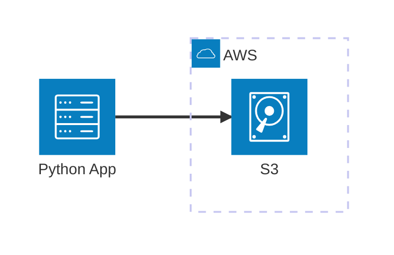

# AWS S3 (MinIO)

MVE emulating S3 with MinIO for local data pipelines. This example demonstrates how to integrate `boto3`, `pyarrow` (S3FileSystem), and `deltalake` with a local MinIO instance.

## Architecture

## Index

- [Prerequisites](#prerequisites)
- [Quickstart](#quickstart)
- [Setup Environment](#setup-environment)
- [Start Infrastructure](#start-infrastructure)
- [How to execute](#how-to-execute)
- [How to debug](#how-to-debug)
- [How to test](#how-to-test)
- [Validate results](#validate-results)
- [Clean Up](#clean-up)

## Prerequisites

- [Docker](https://www.docker.com/get-started)
- [Dev Containers extension](vscode:extension/ms-vscode-remote.remote-containers)

## Quickstart

1. **Open in Container**: Open VS Code in the project folder and select **Dev Containers: Reopen in Container**.
2. **Run the Example**: Execute `python main.py`.

## Setup Environment

If you are not using a Dev Container, you can set up the environment manually:
`scripts/setup.sh`

## Start Infrastructure

If you are not using a Dev Container, launch the required containers:
`docker compose up -d`

## How to execute

1. **Using python**:
   - **Run**: `scripts/run_main.sh`
2. **Using AWS CLI**:
   - **Run**: `aws s3 ls`
3. **Using MinIO CLI**:
   - **Run**: `scripts/minio_cli.sh ls myminio`

## How to debug

1. **main.py**:
   - **Open**: `main.py`
   - **Breakpoints**: Place breakpoints where needed.
   - **Run**: Use the standard Python debugger in VS Code.
2. **Tests**:
   - **Open**: `tests/`
   - **Breakpoints**: Place breakpoints where needed.
   - **Run**: Use the VS Code Testing tab to debug individual tests.

## How to test

1. **Individually**: Via VS Code Testing tab.
2. **All tests**: Via automated script (`scripts/run_tests.sh`).

## Validate results

1. **Check using MinIO GUI**:
   - **Open**: `http://localhost:9001`
   - **Credentials**: Use `MINIO_ROOT_USER` and `MINIO_ROOT_PASSWORD` defined in your `.env`.
   - **Verify**: Check the `bronze` and `silver` buckets.
2. **Check using AWS Toolkit**:
   - **Open**: AWS Toolkit extension in VS Code.
   - **Credentials**: Use `S3_ACCESS_KEY` and `S3_SECRET_KEY` defined in your `.env`.
   - **Verify**: Explore S3 buckets.

## Clean Up

Stop services and remove volumes:
`docker compose down -v`
