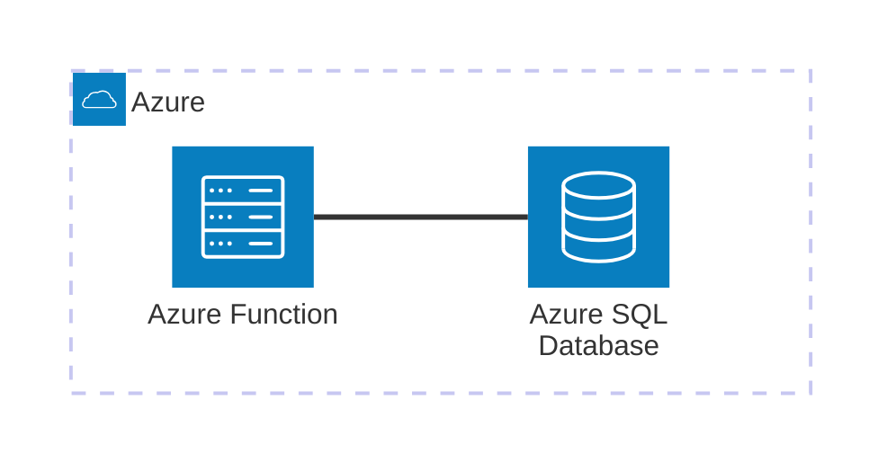

# Azure SQL Database

Ejemplo mínimo viable para trabajar con **Azure SQL Edge** usando **Azure Functions** y **SQLAlchemy**. Este ejemplo demuestra cómo procesar peticiones HTTP POST y persistir datos en una base de datos SQL.

## Arquitectura



[](vscode:extension/mermaidchart.vscode-mermaid-chart)

## Índice

- [Quickstart (Dev Container)](#quickstart-dev-container)
- [Paso a Paso (sin Dev Container)](#paso-a-paso-sin-dev-container)
- [Validación](#validación)
- [Limpieza](#limpieza)
- [Solución de Problemas](#solución-de-problemas)
- [Licencia](#licencia)

## Quickstart (Dev Container)

### Prerrequisitos

- [Docker](https://www.docker.com/get-started) instalado.
- [Extensión Dev Containers](vscode:extension/ms-vscode-remote.remote-containers) de VS Code instalada.

### Pasos

1. **Abrir en Contenedor**: Abre VS Code en la carpeta del proyecto y selecciona **Dev Containers: Reopen in Container** desde la Paleta de Comandos (`F1`).
2. **Iniciar Azurite**: Desde la Paleta de Comandos (`F1`), selecciona **Azurite: Start Blob Service**. Esto inicia el emulador de almacenamiento de blobs local necesario para el runtime de Azure Functions.
3. **Ejecutar la Función**:
   ```bash
   func start
   ```
4. **Ejecutar el Ejemplo**:
   ```bash
   python main.py
   ```

💡 **Próximos Pasos**: Consulta las secciones de [Validación](#validación) y [Limpieza](#limpieza) a continuación.

## Paso a Paso (sin Dev Container)

### 1. Iniciar Infraestructura
Levanta los contenedores de SQL Edge y Azurite:
```bash
docker compose up -d
```

### 2. Configurar Entorno
Instala dependencias y herramientas del sistema usando mise:
```bash
scripts/setup-mve.sh
```

ℹ️ **Nota**: El script de instalación del driver ODBC está configurado para sistemas basados en Debian. Para otros sistemas operativos, consulta la [documentación oficial de Microsoft](https://learn.microsoft.com/en-us/sql/connect/odbc/linux-mac/installing-the-microsoft-odbc-driver-for-sql-server?view=sql-server-ver17&tabs=alpine18-install%2Calpine17-install%2Cdebian8-install%2Credhat7-13-install%2Crhel7-offline).

### 3. Iniciar Azurite
Desde la Paleta de Comandos (`F1`), selecciona **Azurite: Start Blob Service**. Esto inicia el emulador de almacenamiento de blobs local necesario para el runtime de Azure Functions.

### 4. Ejecutar la Función
Inicia el runtime local de Azure Functions:
```bash
func start
```

### 5. Ejecutar el Cliente
En una nueva terminal, ejecuta el script de prueba:
```bash
python main.py
```

## Validación

Este MVE incluye un perfil de conexión pre-configurado para la extensión **SQL Server (mssql)** en `.vscode/settings.json`.

1. Abre la extensión **SQL Server** en VS Code.
2. Selecciona el perfil de conexión `Azure SQL Edge (Local)`.
3. Ejecuta el siguiente comando SQL para verificar los datos:
   ```sql
   SELECT * FROM Users;
   ```

### Datos de Conexión Manual
Si prefieres conectarte manualmente (ej. usando DBeaver):
- **Server**: `azure-sql-edge` (usa `localhost` si te conectas desde fuera del contenedor)
- **Port**: `1433`
- **Database**: `UserDB`
- **Username**: `sa`
- **Password**: `Password123!`
- **Encryption**: `False`
- **Trust Server Certificate**: `True`

## Limpieza

Para detener los servicios y eliminar el estado:
```bash
docker compose down -v
```

## Solución de Problemas

| Problema | Solución |
|----------|----------|
| `ImportError: libodbc.so.2` | Ejecuta `scripts/setup-mve.sh` para instalar las dependencias ODBC del sistema. |
| Error `AzureWebJobsStorage` | Asegúrate de iniciar el servicio de blobs de Azurite en VS Code (**Azurite: Start Blob Service**) y de que el puerto 10000 esté libre. |

## Licencia

Este es un ejemplo mínimo para fines educativos. Siéntete libre de usarlo y modificarlo según sea necesario.
