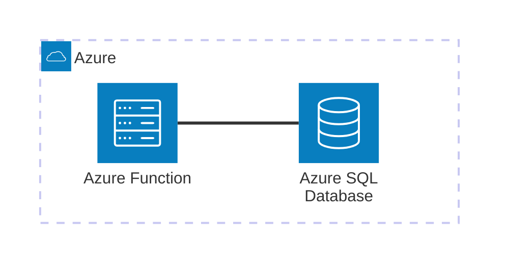

# Azure SQL Database + Azure Functions

Minimal viable example to work with **Azure SQL Edge** using **Azure Functions** and **SQLAlchemy**. This example demonstrates how to process HTTP POST requests and persist data into a SQL database.

## Architecture



[](vscode:extension/mermaidchart.vscode-mermaid-chart)

## Index

- [Quickstart (Dev Container)](#quickstart-dev-container)
- [Step by Step (without Dev Container)](#step-by-step-without-dev-container)
- [Validation](#validation)
- [Clean Up](#clean-up)
- [Troubleshooting](#troubleshooting)
- [License](#license)

## Quickstart (Dev Container)

### Prerequisites

- [Docker](https://www.docker.com/get-started) installed.
- [Dev Containers extension](vscode:extension/ms-vscode-remote.remote-containers) installed.

### Steps

1. **Open in Container**: Open VS Code in the project folder and select **Dev Containers: Reopen in Container** from the Command Palette (`F1`).
2. **Start Azurite**: From the Command Palette (`F1`), select **Azurite: Start Blob Service**. This starts the local blob storage emulator required by the Azure Functions runtime.
3. **Run the Function**:
   ```bash
   func start
   ```
4. **Run the Example**:
   ```bash
   python main.py
   ```

💡 **Next Steps**: See the [Validation](#validation) and [Clean Up](#clean-up) sections below.

## Step by Step (without Dev Container)

### 1. Start Infrastructure
Launch the SQL Edge and Azurite containers:
```bash
docker compose up -d
```

### 2. Setup Environment
Install dependencies and system tools using mise:
```bash
scripts/setup-mve.sh
```

ℹ️ **Note**: The ODBC driver installation script is configured for Debian-based systems. For other operating systems, please refer to the [official Microsoft documentation](https://learn.microsoft.com/en-us/sql/connect/odbc/linux-mac/installing-the-microsoft-odbc-driver-for-sql-server?view=sql-server-ver17&tabs=alpine18-install%2Calpine17-install%2Cdebian8-install%2Credhat7-13-install%2Crhel7-offline).


### 3. Start Azurite
From the Command Palette (`F1`), select **Azurite: Start Blob Service**. This starts the local blob storage emulator required by the Azure Functions runtime.

### 4. Run the Function
Start the local Azure Functions runtime:
```bash
func start
```

### 5. Run the Client
In a new terminal, execute the test script:
```bash
python main.py
```

## Validation

This MVE includes a pre-configured connection profile for the **SQL Server (mssql)** extension in `.vscode/settings.json`.

1. Open the **SQL Server** extension in VS Code.
2. Select the `Azure SQL Edge (Local)` connection profile.
3. Run the following query to verify the data:
   ```sql
   SELECT * FROM Users;
   ```

### Manual Connection Details
If you prefer to connect manually (e.g., using DBeaver or another tool):
- **Server**: `azure-sql-edge` (use `localhost` if connecting from the host)
- **Port**: `1433`
- **Database**: `UserDB`
- **Username**: `sa`
- **Password**: `Password123!`
- **Encryption**: `False`
- **Trust Server Certificate**: `True`

## Clean Up

To stop all services and remove the state:
```bash
docker compose down -v
```

## Troubleshooting

| Issue | Solution |
|-------|----------|
| `ImportError: libodbc.so.2` | Run `scripts/setup-mve.sh` to install system ODBC dependencies. |
| `AzureWebJobsStorage` error | Ensure Azurite Blob Service is started in VS Code (**Azurite: Start Blob Service**) and port 10000 is available. |

## License

This is a minimal example for educational purposes. Feel free to use and modify as needed.
