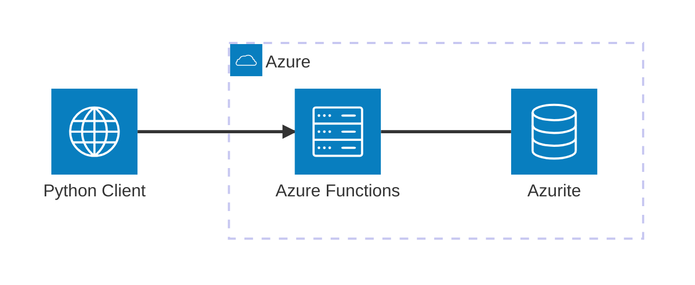

# Azure Functions

Ejemplo Mínimo Viable para trabajar con **Azure Functions** usando **Python** y **Azure Functions Core Tools**. Este ejemplo demuestra cómo desarrollar, ejecutar, depurar, probar y validar una función con trigger HTTP de forma local.

## Architecture


[](vscode:extension/mermaidchart.vscode-mermaid-chart)

## Index

- [Prerrequisitos](#prerrequisitos)
- [Quickstart](#quickstart)
- [Configurar Entorno](#configurar-entorno)
- [Iniciar Infraestructura](#iniciar-infraestructura)
- [Cómo ejecutar](#cómo-ejecutar)
- [Cómo depurar](#cómo-depurar)
- [Cómo probar](#cómo-probar)
- [Validar resultados](#validar-resultados)
- [Limpieza](#limpieza)

## Prerequisites

- [Docker](https://www.docker.com/get-started) instalado y en ejecución.
- [Extensión Dev Containers](vscode:extension/ms-vscode-remote.remote-containers) instalada.

## Quickstart

1. **Abrir en Contenedor**: Abre VS Code en la carpeta del proyecto y selecciona **Dev Containers: Reopen in Container** desde la Paleta de Comandos (`F1`).
2. **Iniciar el emulador**:
   ```bash
   func start
   ```
3. **Ejecutar el Ejemplo**:
   ```bash
   python main.py
   ```

💡 **Siguientes pasos**: Consulta las secciones [How to debug](#how-to-debug), [How to test](#how-to-test), [Validate results](#validate-results) y [Clean Up](#clean-up) a continuación.

## Configurar Entorno

Si no estás usando un Dev Container, puedes configurar el entorno manualmente:

```bash
scripts/setup.sh
```

## Iniciar Infraestructura

Si no estás usando un Dev Container, lanza los contenedores necesarios:

```bash
docker compose up -d
```

Después, inicia el emulador de Azure Functions usando cualquiera de estas opciones:

1. **Usando terminal**:
   ```bash
   func start
   ```

2. **Usando Run and Debug**:
   - **Abrir**: Abre la pestaña **Run and Debug** en VS Code.
   - **Ejecutar**: Selecciona **Attach to Python Functions** y pulsa `F5`. El emulador se inicia y el depurador se conecta automáticamente.

3. **Usando la [extensión Azure Functions](vscode:extension/ms-azuretools.vscode-azurefunctions)**:
   - **Abrir**: Abre el panel lateral **Azure** y navega a **Workspace → Local Project → Functions**.
   - **Ejecutar**: Haz clic en el botón **Start debugging** para iniciar la Function App.

## Cómo ejecutar

1. **Usando python**:
   ```bash
   python main.py
   ```

2. **Usando curl**:
   - **Admin** (éxito):
     ```bash
     curl "http://localhost:7071/api/get_secret?username=admin"
     ```
   - **Otro usuario** (prohibido):
     ```bash
     curl "http://localhost:7071/api/get_secret?username=guest"
     ```

3. **Usando [REST Client](vscode:extension/humao.rest-client)**:
   - **Abrir**: Abre `http/get_secret.http` en VS Code.
   - **Ejecutar**: Haz clic en **Send Request** encima de cada bloque de petición.

## Cómo depurar

1. **function_app.py**:
   - **Abrir**: Abre `function_app.py`.
   - **Breakpoints**: Establece breakpoints dentro de `get_secret`.
   - **Ejecutar**: Desde la pestaña **Run and Debug**, selecciona **Attach to Python Functions** y pulsa `F5`. El emulador se iniciará y el depurador se conectará automáticamente.

2. **main.py**:
   - **Abrir**: Abre `main.py`.
   - **Breakpoints**: Establece breakpoints en la función `main`.
   - **Ejecutar**: Pulsa `F5` para iniciar la depuración.

3. **Tests**:
   - **Abrir**: Abre un archivo de test (p. ej., `tests/test_functions.py`).
   - **Breakpoints**: Establece breakpoints en el código del test.
   - **Ejecutar**: Usa la pestaña **Testing** de VS Code y haz clic en el icono **Debug Test** junto al test que quieras depurar.

## Cómo probar

1. **Individualmente**: Puedes ejecutar los tests individualmente desde la pestaña **Testing** de VS Code.

2. **Todos los tests**: Para ejecutar todos los tests usando el script automatizado:

   ```bash
   scripts/run_tests.sh
   ```

## Validar resultados

Verifica que la función devuelve las respuestas esperadas para cada usuario.

1. **Verificar usando la terminal**:
   - **Ejecutar**: Lanza el script principal y revisa su salida:
     ```bash
     python main.py
     ```
   - **Verificar**: El usuario definido en `ADMIN_USERNAME` (`.env`) debe recibir una respuesta `200` con el valor secreto. Cualquier otro usuario debe recibir `403`.

2. **Verificar usando logs**:
   - **Abrir**: Revisa la terminal donde se está ejecutando `func start`.
   - **Verificar**: Cada petición registra una línea como `Python HTTP trigger function processed a request.`

## Limpieza

Para detener todos los servicios y eliminar el estado:
```bash
docker compose down -v
```
