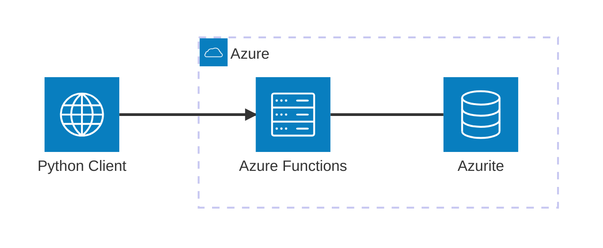

# Azure Functions

Minimal Viable Example to work with **Azure Functions** using **Python** and **Azure Functions Core Tools**. This example demonstrates how to develop, run, debug, test, and validate an HTTP-triggered function locally.

## Architecture


[](vscode:extension/mermaidchart.vscode-mermaid-chart)

## Index

- [Prerequisites](#prerequisites)
- [Quickstart](#quickstart)
- [Setup Environment](#setup-environment)
- [Start Infrastructure](#start-infrastructure)
- [How to execute](#how-to-execute)
- [How to debug](#how-to-debug)
- [How to test](#how-to-test)
- [Validate results](#validate-results)
- [Clean Up](#clean-up)

## Prerequisites

- [Docker](https://www.docker.com/get-started) installed and running.
- [Dev Containers extension](vscode:extension/ms-vscode-remote.remote-containers) installed.

## Quickstart

1. **Open in Container**: Open VS Code in the project folder and select **Dev Containers: Reopen in Container** from the Command Palette (`F1`).
2. **Start the emulator**:
   ```bash
   func start
   ```
3. **Run the Example**:
   ```bash
   python main.py
   ```

💡 **Next Steps**: See the [How to debug](#how-to-debug), [How to test](#how-to-test), [Validate results](#validate-results) and [Clean Up](#clean-up) sections below.

## Setup Environment

If you are not using a Dev Container, you can set up the environment manually:

```bash
scripts/setup.sh
```

## Start Infrastructure

If you are not using a Dev Container, launch the required containers:

```bash
docker compose up -d
```

Then, start the Azure Functions host using any of these options:

1. **Using terminal**:
   ```bash
   func start
   ```

2. **Using Run and Debug**:
   - **Open**: Open the **Run and Debug** tab in VS Code.
   - **Run**: Select **Attach to Python Functions** and press `F5`. The emulator starts and the debugger attaches automatically.

3. **Using [Azure Functions extension](vscode:extension/ms-azuretools.vscode-azurefunctions)**:
   - **Open**: Open the **Azure** sidebar and navigate to **Workspace → Local Project → Functions**.
   - **Run**: Click the **Start debugging** button to start the function app.

## How to execute

1. **Using python**:
   ```bash
   python main.py
   ```

2. **Using curl**:
   - **Admin** (success):
     ```bash
     curl "http://localhost:7071/api/get_secret?username=admin"
     ```
   - **Other user** (forbidden):
     ```bash
     curl "http://localhost:7071/api/get_secret?username=guest"
     ```

3. **Using [REST Client](vscode:extension/humao.rest-client)**:
   - **Open**: Open `http/get_secret.http` in VS Code.
   - **Run**: Click **Send Request** above any request block.

## How to debug

1. **function_app.py**:
   - **Open**: Open `function_app.py`.
   - **Breakpoints**: Set breakpoints inside `get_secret`.
   - **Run**: From the **Run and Debug** tab, select **Attach to Python Functions** and press `F5`. The emulator will start and the debugger will attach automatically.

2. **main.py**:
   - **Open**: Open `main.py`.
   - **Breakpoints**: Set breakpoints in the `main` function.
   - **Run**: Press `F5` to start debugging.

3. **Tests**:
   - **Open**: Open a test file (e.g., `tests/test_functions.py`).
   - **Breakpoints**: Set breakpoints in the test code.
   - **Run**: Use the VS Code **Testing** tab and click the **Debug Test** icon next to the test you want to debug.

## How to test

1. **Individually**: You can run tests individually from the VS Code **Testing** tab.

2. **All tests**: To execute all tests using the automated script:

   ```bash
   scripts/run_tests.sh
   ```

## Validate results

Verify that the function returns the expected responses for each user.

1. **Check using the terminal**:
   - **Run**: Execute the main script and review its output:
     ```bash
     python main.py
     ```
   - **Verify**: The user defined in `ADMIN_USERNAME` (`.env`) should receive a `200` response with the secret value. Any other user should receive `403`.

2. **Check using logs**:
   - **Open**: Review the terminal where `func start` is running.
   - **Verify**: Each request logs a line like `Python HTTP trigger function processed a request.`


## Clean Up

To stop all services and remove the state:
```bash
docker compose down -v
```
