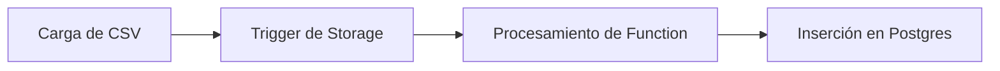
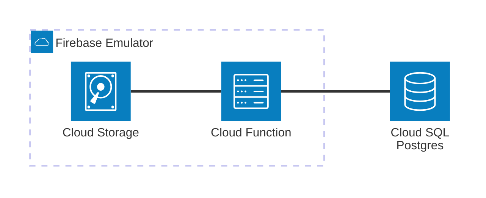

# GCP Cloud SQL (PostgreSQL)

Ejemplo mínimo viable para trabajar con **GCP Cloud SQL (PostgreSQL)** emulado localmente usando **Docker Compose**, y **Firebase Cloud Functions** disparadas por **Cloud Storage**.


[](vscode:extension/mermaidchart.vscode-mermaid-chart)

## Arquitectura



[](vscode:extension/mermaidchart.vscode-mermaid-chart)

## Índice

- [Quickstart (Dev Container)](#quickstart-dev-container)
- [Paso a Paso (sin Dev Container)](#paso-a-paso-sin-dev-container)
    - [1. Iniciar Infraestructura](#1-iniciar-infraestructura)
    - [2. Configurar Entorno](#2-configurar-entorno)
    - [3. Iniciar Emuladores](#3-iniciar-emuladores)
    - [4. Ejecutar el Ejemplo](#4-ejecutar-el-ejemplo)
    - [5. Validación](#5-validación)
- [Limpieza](#limpieza)
- [Solución de Problemas](#solución-de-problemas)
- [Licencia](#licencia)

---

## Quickstart (Dev Container)

El Dev Container instala automáticamente todas las herramientas necesarias (**Node.js**, **Java**, **Firebase Tools**, **mise**, **uv**) y sincroniza las dependencias para su uso inmediato.

1. **Requisitos Previos:**
    - [Docker](https://www.docker.com/get-started) instalado y funcionando.
    - [Extensión Dev Containers](vscode:extension/ms-vscode-remote.remote-containers) instalada.

2. **Abrir Proyecto:** Abre la **Paleta de Comandos** (`F1` o `Ctrl/Cmd+Shift+P`) y selecciona **Dev Containers: Reopen in Container**.

3. **Iniciar Emuladores:** 
   ```bash
   # Terminal 1: Iniciar Emuladores de Firebase
   firebase emulators:start
   ```

4. **Ejecutar MVE:** 
   ```bash
   # Terminal 2: Ejecutar el demo
   python main.py
   ```

5. **Validar Resultados:**
   - **Interfaz UI**: Abre [http://localhost:4000/storage](http://localhost:4000/storage) para ver el archivo y [http://localhost:4000/functions](http://localhost:4000/functions) para los logs.
   - **SQLTools (VS Code)**: Usa la conexión preconfigurada **Postgres** en el explorador de **SQLTools** para consultar la tabla `users`:
     ```sql
     SELECT * FROM users;
     ```

6. **Limpieza:**
   ```bash
   docker compose down -v
   ```

## Paso a Paso (sin Dev Container)

Esta sección detalla el proceso de configuración manual si no utilizas Dev Containers.

### 1. Iniciar Infraestructura

Inicia el contenedor de **PostgreSQL**:

```bash
docker compose up -d postgres
```

### 2. Configurar Entorno

Usa nuestro script de configuración estandarizado para instalar **mise**, **uv**, **Python**, **Node.js**, **Java**, y sincronizar todas las dependencias:

```bash
scripts/setup-mve.sh
```

### 3. Iniciar Emuladores

Inicia la suite de emuladores de Firebase (Storage y Functions):

```bash
firebase emulators:start
```

### 4. Ejecutar el Ejemplo

Ejecuta el script principal para cargar un CSV y verificar el procesamiento:

```bash
python main.py
```

### 5. Validación

Elige tu forma preferida de verificar los resultados:

* **Opción A**: Script Python. Revisa la salida de `main.py`:
    - El script consulta la base de datos hasta que los registros son detectados.

* **Opción B**: Interfaz UI del Emulador. Verifica los recursos directamente en el navegador:
    - **Cloud Storage**: Abre [http://localhost:4000/storage](http://localhost:4000/storage) para ver el `users.csv`.
    - **Logs de Funciones**: Abre [http://localhost:4000/functions](http://localhost:4000/functions) para ver la salida de ejecución.

* **Opción C**: Cliente de Base de Datos. Conecta usando **SQLTools** (preconfigurado en Dev Container) o [DBeaver](https://dbeaver.io/download/):
    - **Host**: `localhost`
    - **Puerto**: `5432`
    - **Base de Datos**: `mve_db`
    - **Credenciales**: `postgres` / `postgres`

    and run:

    ```sql
    SELECT * FROM users;
    ```

## Limpieza

Para eliminar completamente la infraestructura local (contenedores y volúmenes):

```bash
docker compose down -v
```

## Solución de Problemas

| Problema | Solución |
| :--- | :--- |
| **Puerto 5432 en uso** | Asegúrate de que no haya otro Postgres funcionando o cambia el puerto en `docker-compose.yml`. |
| **Java no encontrado** | Asegúrate de tener Java 11+ instalado (requerido por los emuladores de Firebase). |
| **Functions no disparan** | Revisa `firebase-debug.log`. Los nombres de los buckets deben coincidir con el prefijo `demo-`. |

## Licencia

Este es un ejemplo mínimo con fines educativos. Siéntete libre de usarlo y modificarlo según tus necesidades.
