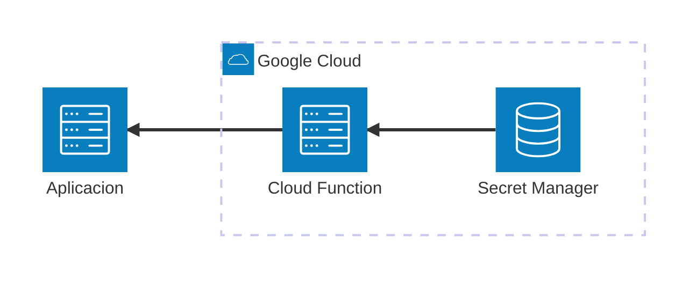

# Firebase Cloud Functions

Este MVE demuestra cómo desarrollar y probar **Google Cloud Firebase Functions** localmente usando **Firebase Emulator Suite**. Incluye una función HTTPS síncrona que recupera un secreto de **Secret Manager** basado en el nombre de usuario.

## Arquitectura



[](vscode:extension/mermaidchart.vscode-mermaid-chart)

## Índice

- [Prerrequisitos](#prerrequisitos)
- [Quickstart](#quickstart)
- [Configurar el Entorno](#configurar-el-entorno)
- [Iniciar Infraestructura](#iniciar-infraestructura)
- [Cómo ejecutar](#cómo-ejecutar)
- [Cómo debuggear](#cómo-debuggear)
- [Cómo probar](#cómo-probar)
- [Validar resultados](#validar-resultados)
- [Limpieza](#limpieza)

## Prerrequisitos

- [Docker](https://www.docker.com/get-started) instalado y ejecutándose.
- Extensión [Dev Containers](vscode:extension/ms-vscode-remote.remote-containers) instalada.

## Quickstart

1. **Abrir en Contenedor**: Abre VS Code en la carpeta del proyecto y selecciona **Dev Containers: Reopen in Container** desde la Paleta de Comandos (`F1`).
2. Inicia el Emulador de Firebase:
   ```bash
   firebase emulators:start
   ```
3. Ejecuta el ejemplo en otra terminal:
   ```bash
   python main.py
   ```

💡 **Próximos Pasos**: Consulta las secciones de [Cómo ejecutar](#cómo-ejecutar) y [Cómo debuggear](#cómo-debuggear) a continuación.

## Configurar el Entorno
Este paso solo es necesario si **no** estás usando un Dev Container.
Instala las dependencias y herramientas del sistema usando el script proporcionado:
```bash
scripts/setup.sh
```

## Iniciar Infraestructura
Inicia Firebase Emulator Suite para emular las funciones localmente:
```bash
firebase emulators:start
```

## Cómo ejecutar

### Using python
Ejecuta el script del cliente para verificar los escenarios de acceso tanto exitosos como denegados:
```bash
python main.py
```

### Using curl
Envía una petición específica para el usuario administrador:
```bash
curl "http://localhost:5001/demo-mve-firebase-functions/us-central1/get_secret?username=admin"
```

### Using REST Client extension
Si no estás usando un Dev Container, primero debes instalar la extensión [REST Client](vscode:extension/humao.rest-client).
1. Abre el archivo `http/get_secret.http`.
2. Haz clic en el texto **Send Request** que aparece sobre las peticiones definidas.

## Cómo debuggear
Puedes debuggear diferentes partes del proyecto usando las configuraciones de depuración de VS Code:

### Una petición específica
1. **Asegúrate de que el Emulador de Firebase no se esté ejecutando** (ya que entraría en conflicto con el puerto del debugger).
2. Lanza el debugger usando la configuración **Debug Cloud Function (Local)**.
3. Pon un punto de ruptura dentro de la función `get_secret` en `functions/main.py`.
4. Envía una petición usando **curl** o **REST Client** apuntando a `http://localhost:8080/`. Puedes usar la petición definida en `http/get_secret.http`.

### El main.py cliente
1. **Asegúrate de que el Emulador de Firebase no se esté ejecutando**.
2. Lanza el debugger usando la configuración **Debug Cloud Function (Local)**.
3. Pon un punto de ruptura en el código que desees inspeccionar.
4. Establece `DEBUG_MODE=True` en tu archivo `.env`.
5. Ejecuta el depurador **Python: Current File** mientras `main.py` está abierto.

### Tests
1. **Inicia el Emulador de Firebase** (`firebase emulators:start`).
2. Pon un punto de ruptura dentro de cualquier prueba en `tests/test_get_secret.py`.
3. Abre la pestaña **Testing** en VS Code y haz clic en el icono **Debug Test** junto a la prueba deseada.

## Cómo probar
Puedes ejecutar las pruebas automatizadas de dos maneras:

### Individualmente
1. Abre el archivo de prueba en `tests/test_get_secret.py`.
2. Haz clic en el botón verde "Play" junto a cualquier función de prueba.

### Todos los tests
Ejecuta el siguiente script desde tu terminal:
```bash
./scripts/run_tests.sh
```
⚠️ **Nota**: El Emulador de Firebase **no** debe estar ejecutándose, ya que el script inicia sus propias instancias a través de `firebase emulators:exec`.

## Validar resultados
Verifica la ejecución abriendo la **UI del Emulador de Firebase** en [http://localhost:4000](http://localhost:4000). Navega a la sección **Logs** para inspeccionar la actividad de la función y los pasos de ejecución.

## Limpieza
Detén los emuladores presionando `Ctrl+C` en la terminal donde se están ejecutando.
Para eliminar volúmenes y logs:
```bash
docker compose down -v
```
