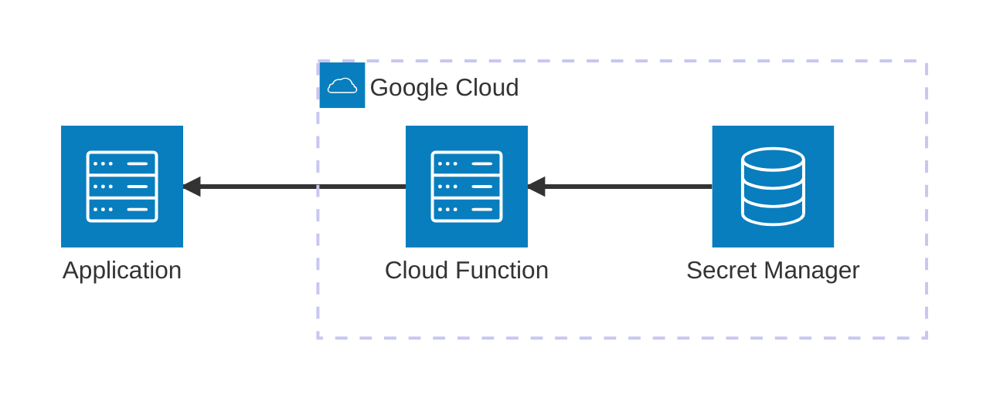

# Firebase Cloud Functions

This MVE demonstrates how to develop and test **Google Cloud Firebase Functions** locally using the **Firebase Emulator Suite**. It includes a synchronous HTTPS function that retrieves a secret from **Secret Manager** based on user name.

## Architecture



[](vscode:extension/mermaidchart.vscode-mermaid-chart)

## Index

- [Prerequisites](#prerequisites)
- [Quickstart](#quickstart)
- [Setup Environment](#setup-environment)
- [Start Infrastructure](#start-infrastructure)
- [How to execute](#how-to-execute)
- [How to debug](#how-to-debug)
- [How to test](#how-to-test)
- [Validate results](#validate-results)
- [Clean Up](#clean-up)

## Prerequisites

- [Docker](https://www.docker.com/get-started) installed and running.
- [Dev Containers extension](vscode:extension/ms-vscode-remote.remote-containers) installed.

## Quickstart

1. **Open in Container**: Open VS Code in the project folder and select **Dev Containers: Reopen in Container** from the Command Palette (`F1`).

2. Start the Firebase Emulator:
   ```bash
   firebase emulators:start
   ```

3. Run the example in another terminal:
   ```bash
   python main.py
   ```

💡 **Next Steps**: See the [How to execute](#how-to-execute) and [How to debug](#how-to-debug) sections below.

## Setup Environment
This step is only necessary if you are **not** using a Dev Container. 
Install dependencies and system tools using the provided script:
```bash
scripts/setup.sh
```

## Start Infrastructure
Start the Firebase Emulator Suite to emulate functions locally:
```bash
firebase emulators:start
```

## How to execute

### Using python
Run the client script to verify both successful and denied access scenarios:
```bash
python main.py
```

### Using curl
Send a request specifically for the admin user:
```bash
curl "http://localhost:5001/demo-mve-firebase-functions/us-central1/get_secret?username=admin"
```

### Using REST Client extension
If you are not using a Dev Container, you must install the [REST Client extension](vscode:extension/humao.rest-client) first.
1. Open the file `http/get_secret.http`.
2. Click on the **Send Request** text that appears above the defined requests.

## How to debug
You can debug different parts of the project using VS Code debug configurations:

### A specific request
1. **Ensure the Firebase Emulator is not running** (as it would conflict with the debugger port).
2. Launch the debugger using the **Debug Cloud Function (Local)** configuration.
3. Set a breakpoint inside the `get_secret` function in `functions/main.py`.
4. Send a request using **curl** or the **REST Client** pointing to `http://localhost:8080/`. You can use the request defined in `http/get_secret.http`.

### The main.py client
1. **Ensure the Firebase Emulator is not running**.
2. Launch the debugger using the **Debug Cloud Function (Local)** configuration.
3. Set a breakpoint in the code you wish to inspect.
4. Set `DEBUG_MODE=True` in your `.env` file.
5. Run the **Python: Current File** debugger while `main.py` is open.

### Tests
1. **Start the Firebase Emulator** (`firebase emulators:start`).
2. Set a breakpoint inside any test in `tests/test_get_secret.py`.
3. Open the **Testing** tab in VS Code and click the **Debug Test** icon next to the desired test.

## How to test
You can run the automated tests in two ways:

### Individually
1. Open the test file in `tests/test_get_secret.py`.
2. Click the green "Play" button next to any test function.

### All tests
Run the following script from your terminal:
```bash
./scripts/run_tests.sh
```
⚠️ **Note**: The Firebase Emulator must **not** be running, as the script starts its own instances via `firebase emulators:exec`.

## Validate results
Verify the execution by opening the **Firebase Emulator UI** at [http://localhost:4000](http://localhost:4000). Navigate to the **Logs** section to inspect function activity and execution steps.

## Clean Up
Stop the emulators by pressing `Ctrl+C` in the terminal where they are running.
To remove volumes and logs:
```bash
docker compose down -v
```
