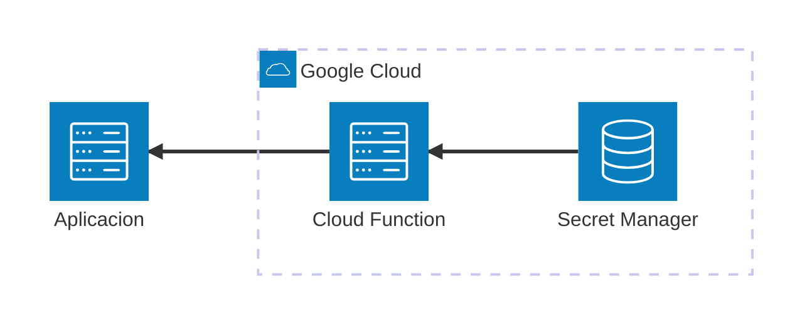

# Firebase Cloud Functions

Este MVE demuestra cómo desarrollar y probar Firebase Functions de Google Cloud localmente usando Firebase Emulator Suite. Incluye una función HTTPS síncrona que recupera un secreto de Secret Manager basado en el nombre de usuario.

## Arquitectura



[](vscode:extension/mermaidchart.vscode-mermaid-chart)

## Índice

- [Quickstart (Dev Container)](#quickstart-dev-container)
- [Paso a Paso (sin Dev Container)](#paso-a-paso-sin-dev-container)
- [Validación](#validación)
- [Limpieza](#limpieza)
- [Solución de Problemas](#solución-de-problemas)

## Quickstart (Dev Container)

### Prerrequisitos

- [Docker](https://www.docker.com/get-started) instalado.
- Extensión [Dev Containers](vscode:extension/ms-vscode-remote.remote-containers) instalada.


### Pasos
1. **Abrir en Contenedor**: Abre VS Code en la carpeta del proyecto y selecciona **Dev Containers: Reabrir en Contenedor** desde la Paleta de Comandos (`F1`).
2. Inicia el Emulador de Firebase:
   ```bash
   firebase emulators:start
   ```
3. Ejecuta el ejemplo en otra terminal:
   ```bash
   python main.py
   ```

💡 **Próximos Pasos**: Consulta las secciones de [Validación](#validación) y [Limpieza](#limpieza) a continuación.

## Paso a Paso (sin Dev Container)
### 1. Configurar el Entorno
Instala las dependencias y herramientas del sistema usando mise:
```bash
scripts/setup.sh
```

### 2. Iniciar el Emulador de Firebase
Inicia los emuladores (functions y ui):
```bash
firebase emulators:start
```

### 3. Ejecutar el Ejemplo
Ejecuta el script del cliente:
```bash
python main.py
```

## Validación

### Opción A: Cliente Python
Ejecuta el script del cliente para verificar los escenarios de acceso tanto exitosos como denegados:
```bash
python main.py
```

### Opción B: Cliente REST (VS Code)
Usa el archivo [.vscode/get_secret.http](.vscode/get_secret.http) con la extensión REST Client.

### Opción C: Interfaz de Firebase
Abre la interfaz del emulador de Firebase en [http://localhost:4000](http://localhost:4000) para inspeccionar los logs y la ejecución de la función.

### Opción D: Pruebas Automatizadas
Ejecuta las pruebas usando el script proporcionado:
```bash
firebase emulators:exec "./scripts/run_tests.sh"
```

## Limpieza

Detén los emuladores presionando `Ctrl+C` en la terminal donde se están ejecutando.
Para eliminar volúmenes y logs:
```bash
docker compose down -v
```

## Solución de Problemas

| Problema | Solución |
|----------|----------|
| Puerto 5001 ya en uso | Cambia el puerto en `firebase.json` o detén el servicio en conflicto. |
| Comando firebase no encontrado | Asegúrate de que `firebase-tools` esté instalado vía `npm install -g firebase-tools` o revisa tu PATH. |
| Las funciones no cargan | Revisa el archivo `functions/requirements.txt` y asegúrate de que el entorno virtual esté configurado correctamente. |
