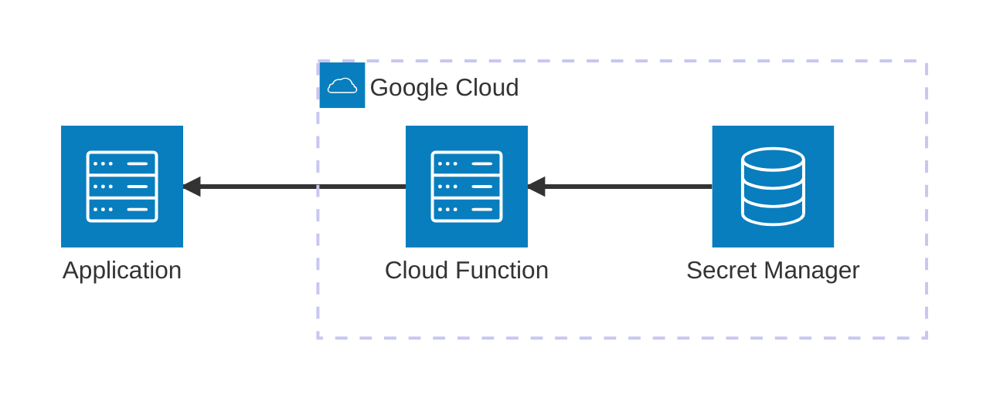

# Firebase Cloud Functions

This MVE demonstrates how to develop and test Google Cloud Firebase Functions locally using the Firebase Emulator Suite. It includes a synchronous HTTPS function that retrieves a secret from Secret Manager based on user name.

## Architecture



[](vscode:extension/mermaidchart.vscode-mermaid-chart)

## Index

- [Quickstart (Dev Container)](#quickstart-dev-container)
- [Step by Step (without Dev Container)](#step-by-step-without-dev-container)
- [Validation](#validation)
- [Clean Up](#clean-up)
- [Troubleshooting](#troubleshooting)

## Quickstart (Dev Container)

### Prerequisites

- [Docker](https://www.docker.com/get-started) installed.
- [Dev Containers extension](vscode:extension/ms-vscode-remote.remote-containers) installed.


### Steps
1. **Open in Container**: Open VS Code in the project folder and select **Dev Containers: Reopen in Container** from the Command Palette (`F1`).
2. Start the Firebase Emulator:
   ```bash
   firebase emulators:start
   ```
3. Run the example in another terminal:
   ```bash
   python main.py
   ```

💡 **Next Steps**: See the [Validation](#validation) and [Clean Up](#clean-up) sections below.

## Step by Step (without Dev Container)
### 1. Setup Environment
Install dependencies and system tools using mise:
```bash
scripts/setup.sh
```

### 2. Start Firebase Emulator
Start the emulators (functions and ui):
```bash
firebase emulators:start
```

### 3. Run Example
Execute the client script:
```bash
python main.py
```

## Validation

### Option A: Python Client
Run the client script to verify both successful and denied access scenarios:
```bash
python main.py
```

### Option B: REST Client (VS Code)
Use the [.vscode/get_secret.http](.vscode/get_secret.http) file with the REST Client extension.

### Option C: Firebase UI
Open the Firebase Emulator UI at [http://localhost:4000](http://localhost:4000) to inspect logs and function execution.

### Option D: Automated Tests
Run the tests using the provided script:
```bash
firebase emulators:exec "./scripts/run_tests.sh"
```

## Clean Up

Stop the emulators by pressing `Ctrl+C` in the terminal where they are running.
To remove volumes and logs:
```bash
docker compose down -v
```

## Troubleshooting

| Issue | Solution |
|-------|----------|
| Port 5001 already in use | Change the port in `firebase.json` or stop the conflicting service. |
| Firebase command not found | Ensure `firebase-tools` is installed via `npm install -g firebase-tools` or check your PATH. |
| Functions not loading | Check the `functions/requirements.txt` and ensure the virtual environment is correctly set up. |
