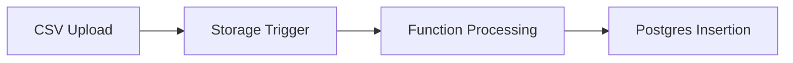
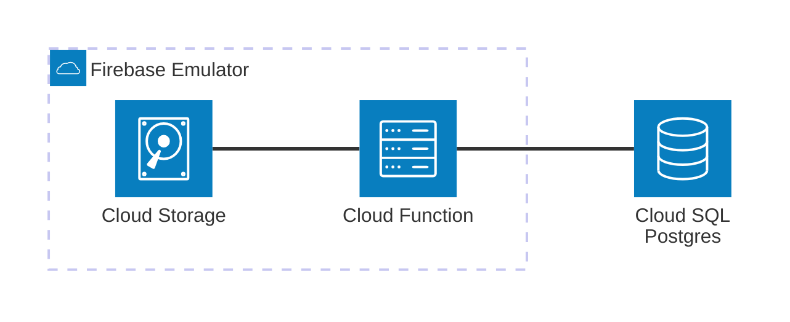

# GCP Cloud SQL (PostgreSQL)

Minimal viable example for **GCP Cloud SQL (PostgreSQL)** emulated locally using **Docker Compose**, and **Firebase Cloud Functions** triggered by **Cloud Storage**.


[](vscode:extension/mermaidchart.vscode-mermaid-chart)

## Architecture



[](vscode:extension/mermaidchart.vscode-mermaid-chart)

## Index

- [Quickstart (Dev Container)](#quickstart-dev-container)
- [Step by Step (without Dev Container)](#step-by-step-without-dev-container)
    - [1. Start Infrastructure](#1-start-infrastructure)
    - [2. Setup Environment](#2-setup-environment)
    - [3. Start Emulators](#3-start-emulators)
    - [4. Run the Example](#4-run-the-example)
    - [5. Validation](#5-validation)
- [Clean Up](#clean-up)
- [Troubleshooting](#troubleshooting)

---

## Quickstart (Dev Container)

The Dev Container automatically installs all required tools (**Node.js**, **Java**, **Firebase Tools**, **mise**, **uv**) and synchronizes dependencies for immediate use.

1. **Prerequisites:**
    - [Docker](https://www.docker.com/get-started) installed and running.
    - [Dev Containers extension](vscode:extension/ms-vscode-remote.remote-containers) installed.

2. **Open Project:** Open the **Command Palette** (`F1` or `Ctrl/Cmd+Shift+P`) and select **Dev Containers: Reopen in Container**.

3. **Start Emulators:** 
   ```bash
   # Terminal 1: Start Firebase Emulators
   firebase emulators:start
   ```

4. **Run MVE:** 
   ```bash
   # Terminal 2: Run the demo
   python main.py
   ```

5. **Verify Results:**
   - **Firebase UI**: Open [http://localhost:4000/storage](http://localhost:4000/storage) to see the file and [http://localhost:4000/functions](http://localhost:4000/functions) for logs.
   - **SQLTools (VS Code)**: Use the preconfigured **Postgres** connection in the **SQLTools** explorer to query the `users` table:
     ```sql
     SELECT * FROM users;
     ```

6. **Clean Up:**
   ```bash
   docker compose down -v
   ```

## Step by Step (without Dev Container)

This section details the manual setup process for those not using Dev Containers.

### 1. Start Infrastructure

Start the **PostgreSQL** container:

```bash
docker compose up -d postgres
```

### 2. Setup Environment

Use our standardized setup script to install **mise**, **uv**, **Python**, **Node.js**, **Java**, and sync all dependencies:

```bash
scripts/setup-mve.sh
```

### 3. Start Emulators

Start the Firebase Emulator Suite (Storage and Functions):

```bash
firebase emulators:start
```

### 4. Run the Example

Execute the main script to upload a CSV and verify processing:

```bash
python main.py
```

### 5. Validation

Choose your preferred way to verify the results:

* **Option A**: Python Script. Review the output in `main.py`:
    - It polls the database until the records are detected.

* **Option B**: Emulator UI. Verify resources directly in the browser:
    - **Cloud Storage**: Open [http://localhost:4000/storage](http://localhost:4000/storage) to see the `users.csv`.
    - **Function Logs**: Open [http://localhost:4000/functions](http://localhost:4000/functions) to see execution output.

* **Option C**: Database Client. Connect using **SQLTools** (preconfigured in Dev Container) or [DBeaver](https://dbeaver.io/download/):
    - **Host**: `localhost`
    - **Port**: `5432`
    - **Database**: `mve_db`
    - **Credentials**: `postgres` / `postgres`

    and run:

    ```sql
    SELECT * FROM users;
    ```

## Clean Up

To completely remove the local infrastructure (containers and volumes):

```bash
docker compose down -v
```

## Troubleshooting

| Issue | Solution |
| :--- | :--- |
| **Port 5432 in use** | Ensure no local PostgreSQL is running or change the port in `docker-compose.yml`. |
| **Java not found** | Ensure Java 11+ is installed (required by Firebase Emulators). |
| **Functions not triggered** | Check `firebase-debug.log` for bucket name mismatches (must match `demo-` prefix). |

