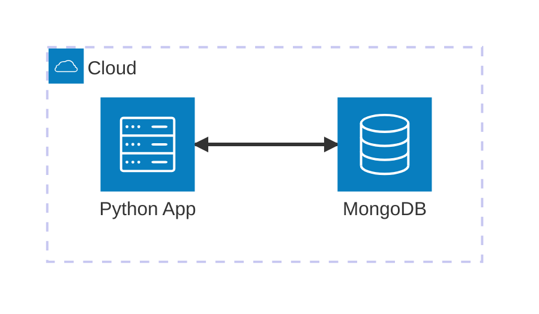

# MongoDB

MVE (Minimal Viable Example) para trabajar con **MongoDB** usando **Python**, **Docker Compose** y **MongoEngine ODM**. Este ejemplo demuestra operaciones CRUD básicas y cómo usar diferentes herramientas para la ejecución y validación.

## Arquitectura


[](vscode:extension/mermaidchart.vscode-mermaid-chart)

## Índice

- [Prerrequisitos](#prerrequisitos)
- [Quickstart](#quickstart)
- [Configurar Entorno](#configurar-entorno)
- [Iniciar Infraestructura](#iniciar-infraestructura)
- [Cómo ejecutar](#cómo-ejecutar)
- [Cómo depurar](#cómo-depurar)
- [Cómo probar](#cómo-probar)
- [Validar resultados](#validar-resultados)
- [Limpieza](#limpieza)

## Prerrequisitos

- [Docker](https://www.docker.com/get-started) instalado y funcionando.
- [Extensión Dev Containers](vscode:extension/ms-vscode-remote.remote-containers) instalada.

## Quickstart

1. **Abrir en Contenedor**: Abre VS Code en la carpeta del proyecto y selecciona **Dev Containers: Reopen in Container** desde la Paleta de Comandos (`F1`).
2. **Ejecutar el Ejemplo**:
   ```bash
   python main.py
   ```

💡 **Siguientes Pasos**: Consulta las secciones [Cómo depurar](#cómo-depurar), [Cómo probar](#cómo-probar), [Validar resultados](#validar-resultados) y [Limpieza](#limpieza) a continuación.

## Configurar Entorno

Si no estás usando un Dev Container, puedes configurar el entorno manualmente:

```bash
scripts/setup.sh
```

## Iniciar Infraestructura

Si no estás usando un Dev Container, lanza los contenedores necesarios:
```bash
docker compose up -d
```

## Cómo ejecutar

1. **Usando python**:
   ```bash
   python main.py
   ```

2. **Usando mongosh**:
   - **Entrar al Shell**: 
     ```bash
     scripts/mongosh.sh
     ```
   - **Copiar**: Copia y pega el código de `playgrounds/users.mongodb.js` en la shell.

3. **Usando [MongoDB for VS Code](vscode:extension/mongodb.mongodb-vscode)**:
   - **Conectar**: Conéctate usando la `MONGO_URI` definida en tu archivo `.env`.
   - **Abrir**: Abre `playgrounds/users.mongodb.js`.
   - **Ejecutar**: Haz clic en el icono de **Play** arriba a la derecha del editor.

4. **Usando [MongoDB Compass](https://www.mongodb.com/try/download/compass)**:
   - **Conectar**: Conéctate usando la `MONGO_URI` definida en tu archivo `.env`.
   - **Navegar**: Navega a `my_db` -> `users`.
   - **Insertar**: Haz clic en **Add Data** -> **Insert Document** para crear un usuario manualmente.
   - **Mongosh**: Alternativamente, abre la **Mongosh integrada** y copia y pega el código de `playgrounds/users.mongodb.js`.

## Cómo depurar

1. **main.py**:
   - **Abrir**: Abre `main.py`.
   - **Puntos de interrupción**: Establece puntos de interrupción en el código.
   - **Ejecutar**: Presiona `F5` para iniciar la depuración.

2. **Pruebas**:
   - **Abrir**: Abre un archivo de prueba (ej. `tests/test_user.py`).
   - **Puntos de interrupción**: Establece puntos de interrupción en el código de prueba.
   - **Ejecutar**: Usa la pestaña de **Testing** de VS Code y haz clic en el icono de **Debug Test** al lado de la prueba que quieras depurar.

## Cómo probar

1. **Individualmente**: Puedes ejecutar pruebas individualmente desde la pestaña **Testing** de VS Code.

2. **Todas las pruebas**: Para ejecutar todas las pruebas (unitarias y de integración) usando el script automatizado:

   ```bash
   scripts/run_tests.sh
   ```

## Validar resultados

Verifica que los datos del usuario se guarden correctamente en MongoDB.

1. **Verificar usando mongosh**:
   - **Entrar al Shell**: Ejecuta el script de conexión:
     ```bash
     scripts/mongosh.sh
     ```
   - **Consultar Datos**: Ejecuta la siguiente consulta para ver todos los usuarios:
     ```javascript
     db.getSiblingDB('my_db').users.find().pretty()
     ```

2. **Verificar usando [MongoDB for VS Code](vscode:extension/mongodb.mongodb-vscode)**:
   - **Conectar**: Conéctate usando la `MONGO_URI` definida en tu archivo `.env`.
   - **Verificar**: Navega a `my_db` -> `users`.
   - **Interactivo**: Puedes usar los **Playgrounds** para ejecutar consultas interactivas.

3. **Verificar usando [MongoDB Compass](https://www.mongodb.com/try/download/compass)**:
   - **Conectar**: Conéctate usando la `MONGO_URI` definida en tu archivo `.env`.
   - **Verificar**: Navega a `my_db` -> `users`.
   - **Interactivo**: Puedes usar la **Mongosh integrada** para ejecutar consultas interactivas.

## Limpieza

Para detener todos los servicios y eliminar el estado:
```bash
docker compose down -v
```
