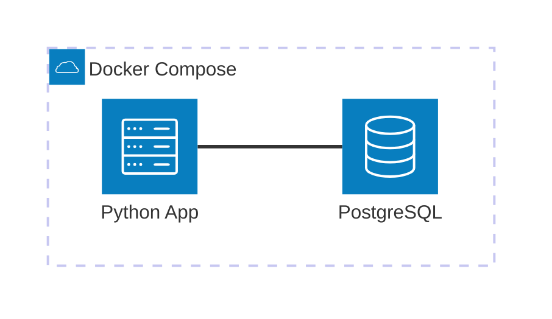

# Postgres Docker

Ejemplo mínimo viable para trabajar con PostgreSQL utilizando Docker Compose, SQLAlchemy ORM y Python. Este ejemplo demuestra cómo configurar una base de datos contenedorizada con inicialización automática del esquema.

## Diagrama de Arquitectura



[](vscode:extension/mermaidchart.vscode-mermaid-chart)

## Índice

- [Quickstart (Dev Container)](#quickstart-dev-container)
- [Paso a Paso (sin Dev Container)](#paso-a-paso-sin-dev-container)
- [Validación](#validación)
- [Limpieza](#limpieza)
- [Solución de Problemas](#solución-de-problemas)
- [Licencia](#licencia)

## Quickstart (Dev Container)

Esta es la forma recomendada de ejecutar el ejemplo.

### Requisitos Previos

- [Docker](https://www.docker.com/get-started) instalado.
- [Dev Containers extension](vscode:extension/ms-vscode-remote.remote-containers) instalada.

### Pasos

1.  **Abrir en Contenedor**: Abre la carpeta del proyecto en VS Code y selecciona **Dev Containers: Reopen in Container** desde la Paleta de Comandos (`F1`).
2.  **Ejecutar el Ejemplo**:
    ```bash
    python main.py
    ```
3.  **Verificar Resultados**:
    - **SQLTools (VS Code)**: Utiliza la conexión preconfigurada en el explorador de **SQLTools** para consultar la tabla `users`:
      ```sql
      SELECT * FROM users;
      ```
4.  **Limpieza**:
    ```bash
    docker compose down -v
    ```

## Paso a Paso (sin Dev Container)

### 1. Iniciar Infraestructura

Inicia la base de datos PostgreSQL:

```bash
docker compose up -d
```

### 2. Configurar el Entorno

En lugar de una configuración manual, utiliza nuestro script de configuración estandarizado. Este script instala automáticamente **uv**, sincroniza las dependencias y prepara el entorno.

```bash
scripts/setup-mve.sh
```

### 3. Ejecutar el Ejemplo

Ejecuta el script principal para crear las tablas e insertar datos de ejemplo:

```bash
python main.py
```

## Validación

### Opción A: Script de Python

El propio script valida la conexión consultando los datos insertados. Deberías ver una salida como:

```text
✓ Tables created successfully
✓ Inserted 3 users successfully

Inserted users:
  - <User(id=1, name='John Doe', email='john@example.com')>
...
```

### Opción B: Validación SQL

Puedes conectarte directamente a la base de datos para verificar los datos:

```bash
docker exec -it postgres_local psql -U admin -d testdb -c "SELECT * FROM users;"
```

### Opción C: Cliente de Base de Datos

Conéctate usando **SQLTools** (preconfigurado en Dev Container) o [DBeaver](https://dbeaver.io/download/):

- **Host**: `localhost`
- **Port**: `5432`
- **Base de datos**: `testdb`
- **Credenciales**: `admin` / `admin123`

Y ejecuta:

```sql
SELECT * FROM users;
```

## Limpieza

Para eliminar completamente todo (contenedores y volúmenes):

```bash
docker compose down -v
```

## Solución de Problemas

| Problema | Solución |
|----------|----------|
| Puerto 5432 ya en uso | Cambia `POSTGRES_PORT` en `.env` y reinicia. |
| Conexión rechazada | Asegúrate de que el contenedor postgres esté corriendo con `docker ps`. |

## Licencia

Este es un ejemplo mínimo para fines educativos. Siéntete libre de usarlo y modificarlo según sea necesario.