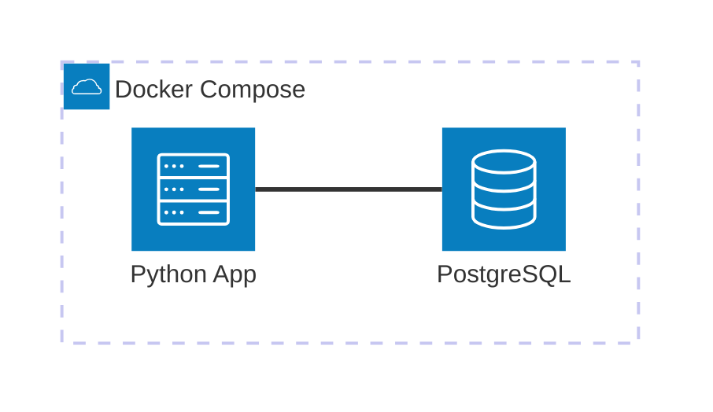

# Postgres Docker

Minimal viable example to work with PostgreSQL using Docker Compose, SQLAlchemy ORM, and Python. This example demonstrates how to set up a containerized database with automatic schema initialization.

## Architecture Diagram



[](vscode:extension/mermaidchart.vscode-mermaid-chart)

## Index

- [Quickstart (Dev Container)](#quickstart-dev-container)
- [Step by Step (without Dev Container)](#step-by-step-without-dev-container)
- [Validation](#validation)
- [Clean Up](#clean-up)
- [Troubleshooting](#troubleshooting)

## Quickstart (Dev Container)

This is the recommended way to run the example.

### Prerequisites

- [Docker](https://www.docker.com/get-started) installed.
- [Dev Containers extension](vscode:extension/ms-vscode-remote.remote-containers) installed.

### Steps

1.  **Open in Container**: Open the project folder in VS Code and select **Dev Containers: Reopen in Container** from the Command Palette (`F1`).
2.  **Run the Example**:
    ```bash
    python main.py
    ```
3.  **Verify Results**:
    - **SQLTools (VS Code)**: Use the preconfigured connection in the **SQLTools** explorer to query the `users` table:
      ```sql
      SELECT * FROM users;
      ```
4.  **Clean Up**:
    ```bash
    docker compose down -v
    ```

## Step by Step (without Dev Container)

### 1. Start Infrastructure

Start the PostgreSQL database:

```bash
docker compose up -d
```

### 2. Setup Environment

Instead of manual configuration, use our standardized setup script. This script automatically installs **uv**, syncs dependencies, and prepares the environment.

```bash
scripts/setup-mve.sh
```

### 3. Run the Example

Execute the main script to create tables and insert sample data:

```bash
python main.py
```

## Validation

### Option A: Python Script

The script itself validates the connection by querying the inserted data. You should see output like:

```text
✓ Tables created successfully
✓ Inserted 3 users successfully

Inserted users:
  - <User(id=1, name='John Doe', email='john@example.com')>
...
```

### Option B: SQL Validation

You can connect directly to the database to verify the data:

```bash
docker exec -it postgres_local psql -U admin -d testdb -c "SELECT * FROM users;"
```

### Option C: Database Client

Connect using **SQLTools** (preconfigured in Dev Container) or [DBeaver](https://dbeaver.io/download/):

- **Host**: `localhost`
- **Port**: `5432`
- **Database**: `testdb`
- **Credentials**: `admin` / `admin123`

And run:

```sql
SELECT * FROM users;
```

## Clean Up

To completely remove everything (containers and volumes):

```bash
docker compose down -v
```

## Troubleshooting

| Issue | Solution |
|-------|----------|
| Port 5432 already in use | Change `POSTGRES_PORT` in `.env` and restart. |
| Connection refused | Ensure the postgres container is running with `docker ps`. |

