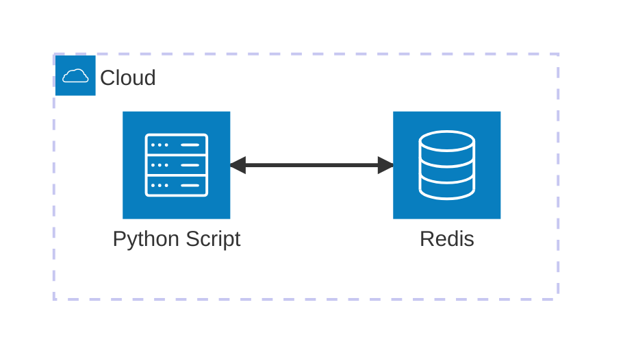

# Redis

Ejemplo mínimo viable para trabajar con **Redis** usando **Python** y **Docker**. Este ejemplo demuestra cómo gestionar el estado de un usuario (Enum) usando Redis y un gestor de contexto personalizado para la gestión de conexiones.

## Arquitectura



[](vscode:extension/mermaidchart.vscode-mermaid-chart)

## Índice

- [Requisitos Previos](#requisitos-previos)
- [Inicio Rápido](#inicio-rápido)
- [Configurar Entorno](#configurar-entorno)
- [Iniciar Infraestructura](#iniciar-infraestructura)
- [Cómo ejecutar](#cómo-ejecutar)
- [Cómo depurar](#cómo-depurar)
- [Cómo probar](#cómo-probar)
- [Validar resultados](#validar-resultados)
- [Limpieza](#limpieza)

## Requisitos Previos

- [Docker](https://www.docker.com/get-started) instalado y funcionando.
- [Extensión Dev Containers](vscode:extension/ms-vscode-remote.remote-containers) instalada.

## Inicio Rápido

1. **Abrir en Contenedor**: Abre VS Code en la carpeta del proyecto y selecciona **Dev Containers: Reopen in Container** desde la Paleta de Comandos (`F1`).
2. **Ejecutar el Ejemplo**:
   ```bash
   python main.py
   ```

💡 **Siguientes Pasos**: Consulta las secciones [Cómo depurar](#cómo-depurar), [Cómo probar](#cómo-probar), [Validar resultados](#validar-resultados) y [Limpieza](#limpieza) a continuación.

## Configurar Entorno

Si no estás usando un Dev Container, puedes configurar el entorno manualmente:

```bash
scripts/setup.sh
```

## Iniciar Infraestructura

Si no estás usando un Dev Container, lanza los contenedores necesarios:
```bash
docker compose up -d
```

## Cómo ejecutar

1. **Usando python**:
   ```bash
   python main.py
   ```

2. **Usando Redis CLI**:
   - **Entrar al Shell**: Ejecuta `scripts/redis_cli.sh`.
   - **Ejecutar Comandos**: Prueba a establecer una clave manualmente:
     ```bash
     SET raulcastillabravo:status "available"
     ```

## Cómo depurar

1. **main.py**:
   - **Abrir**: Abre `main.py`.
   - **Puntos de interrupción**: Establece puntos de interrupción en el código.
   - **Ejecutar**: Presiona `F5` para iniciar la depuración.

2. **Pruebas**:
   - **Abrir**: Abre un archivo de prueba (ej. `tests/providers/test_redis_client.py`).
   - **Puntos de interrupción**: Establece puntos de interrupción en el código de prueba.
   - **Ejecutar**: Usa la pestaña de **Testing** de VS Code y haz clic en el icono de **Debug Test** al lado de la prueba que quieras depurar.

## Cómo probar

1. **Individualmente**: Puedes ejecutar pruebas individualmente desde la pestaña **Testing** de VS Code.

2. **Todas las pruebas**: Para ejecutar todas las pruebas (unitarias y de integración) usando el script automatizado:
   ```bash
   scripts/run_tests.sh
   ```

## Validar resultados

Verifica que el estado del usuario se guarde correctamente en Redis.

1. **Verificar usando Redis CLI**:
   - **Entrar al Shell**: Ejecuta el script para entrar al shell interactivo:
     ```bash
     scripts/redis_cli.sh
     ```
   - **Consultar Datos**: Dentro del shell, ejecuta el comando GET:
     ```bash
     GET raulcastillabravo:status
     ```

2. **Verificar usando [Database Client](vscode:extension/cweijan.vscode-database-client2)**:
   - **Conectar**: Conéctate usando los mismos ajustes de conexión definidos en tu archivo `.env`.
   - **Interactivo**: Puedes navegar por los datos y también abrir el **Redis CLI** directamente desde la interfaz de la extensión.

3. **Verificar usando [Redis Insight](https://redis.io/insight/)**:
   - **Conectar**: Conéctate usando los mismos ajustes de conexión definidos en tu archivo `.env`.
   - **Verificar**: Navega por las claves para ver `raulcastillabravo:status`.

## Limpieza

Para detener todos los servicios y eliminar el estado:
```bash
docker compose down -v
```
