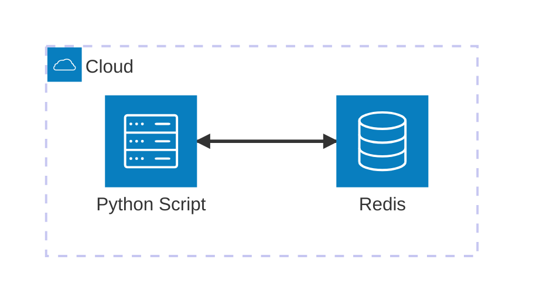

# Redis

Ejemplo mínimo viable para trabajar con **Redis** usando **Python** y **Docker**. Este ejemplo demuestra cómo gestionar el estado de un usuario (Enum) usando Redis y un gestor de contexto personalizado para la gestión de conexiones.

## Arquitectura



[](vscode:extension/mermaidchart.vscode-mermaid-chart)

## Índice

- [Requisitos Previos](#requisitos-previos)
- [Inicio Rápido](#inicio-rápido)
- [Configurar Entorno](#configurar-entorno)
- [Iniciar Infraestructura](#iniciar-infraestructura)
- [Cómo ejecutar](#cómo-ejecutar)
- [Cómo depurar](#cómo-depurar)
- [Cómo probar](#cómo-probar)
- [Validar resultados](#validar-resultados)
- [Limpieza](#limpieza)

## Requisitos Previos

- [Docker](https://www.docker.com/get-started) instalado y funcionando.
- [Extensión Dev Containers](vscode:extension/ms-vscode-remote.remote-containers) instalada.

## Inicio Rápido

1. **Abrir en Contenedor**: Abre VS Code en la carpeta del proyecto y selecciona **Dev Containers: Reopen in Container** desde la Paleta de Comandos (`F1`).
2. **Ejecutar el Ejemplo**:
   ```bash
   python main.py
   ```

💡 **Siguientes Pasos**: Consulta las secciones [Cómo depurar](#cómo-depurar), [Cómo probar](#cómo-probar), [Validar resultados](#validar-resultados) y [Limpieza](#limpieza) a continuación.

## Configurar Entorno

Instala dependencias y herramientas del sistema usando mise:
```bash
scripts/setup.sh
```

## Iniciar Infraestructura

Lanza los contenedores necesarios:
```bash
docker compose up -d
```

## Cómo ejecutar

### Usando python

```bash
python main.py
```

## Cómo depurar

### El cliente main.py

1. Abre `main.py`.
2. Establece puntos de interrupción en el código.
3. Presiona `F5` para iniciar la depuración.

## Cómo probar

### Todas las pruebas

Ejecuta la suite de pruebas automatizadas:
```bash
scripts/run_tests.sh
```

## Validar resultados

Verifica que el estado del usuario se guarde correctamente en Redis.

1. **Verificar usando Redis CLI**: 
   - **Entrar al Shell**: Ejecuta el script para entrar al shell interactivo:
     ```bash
     scripts/redis_cli.sh
     ```
   - **Consultar Datos**: Dentro del shell, ejecuta el comando GET:
     ```bash
     GET raulcastillabravo:status
     ```

2. **Verificar usando [Database Client](vscode:extension/cweijan.vscode-database-client2)**: 
   - Añade una nueva conexión de Redis con:
     - **Host**: `localhost`
     - **Puerto**: `6379`
     - **Contraseña**: `redis123`
   - Puedes navegar por los datos y también abrir el **Redis CLI** directamente desde la interfaz de la extensión.

3. **Verificar usando [Redis Insight](https://redis.io/insight/)**: Conéctate a la base de datos y navega por las claves para ver `raulcastillabravo:status`. Usa los mismos detalles de conexión que en el punto anterior.

## Limpieza

Para detener todos los servicios y eliminar el estado:
```bash
docker compose down -v
```
