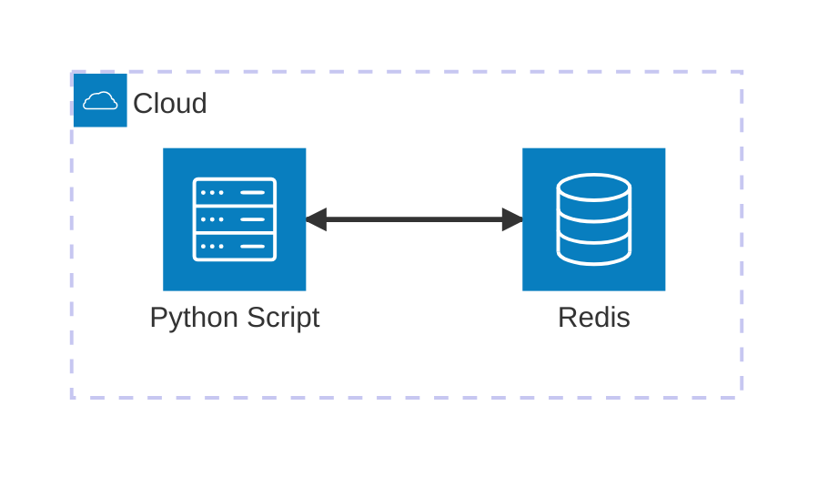

# Redis

Minimal viable example to work with **Redis** using **Python** and **Docker**. This example demonstrates how to manage user status (Enum) using Redis and a custom context manager for connection management.

## Architecture



[](vscode:extension/mermaidchart.vscode-mermaid-chart)

## Index

- [Prerequisites](#prerequisites)
- [Quickstart](#quickstart)
- [Setup Environment](#setup-environment)
- [Start Infrastructure](#start-infrastructure)
- [How to execute](#how-to-execute)
- [How to debug](#how-to-debug)
- [How to test](#how-to-test)
- [Validate results](#validate-results)
- [Clean Up](#clean-up)

## Prerequisites

- [Docker](https://www.docker.com/get-started) installed and running.
- [Dev Containers extension](vscode:extension/ms-vscode-remote.remote-containers) installed.

## Quickstart

1. **Open in Container**: Open VS Code in the project folder and select **Dev Containers: Reopen in Container** from the Command Palette (`F1`).
2. **Run the Example**:
   ```bash
   python main.py
   ```

💡 **Next Steps**: See the [How to debug](#how-to-debug), [How to test](#how-to-test), [Validate results](#validate-results) and [Clean Up](#clean-up) sections below.

## Setup Environment

If you are not using a Dev Container, you can set up the environment manually:

```bash
scripts/setup.sh
```

## Start Infrastructure

Launch the required containers:
```bash
docker compose up -d
```

## How to execute

### Using python

```bash
python main.py
```

## How to debug

### The main.py client

1. Open `main.py`.
2. Set breakpoints in the code.
3. Press `F5` to start debugging.

## How to test

### Individually

You can run tests individually from the VS Code **Testing** tab.

### All tests

To execution all tests (unit and integration) using the automated script:

```bash
scripts/run_tests.sh
```

## Validate results

Verify that the user status is correctly stored in Redis.

1. **Check using Redis CLI**: 
   - **Enter Shell**: Run the script to enter the interactive shell:
     ```bash
     scripts/redis_cli.sh
     ```
   - **Check Data**: Inside the shell, run the GET command:
     ```bash
     GET raulcastillabravo:status
     ```

2. **Check using [Database Client](vscode:extension/cweijan.vscode-database-client2)**: 
   - Add a new Redis connection with:
     - **Host**: `localhost`
     - **Port**: `6379`
     - **Password**: `redis123`
   - You can browse the data and also open the **Redis CLI** directly from the extension UI.

3. **Check using [Redis Insight](https://redis.io/insight/)**: Connect to the database and browse keys to see `raulcastillabravo:status`. Use the same connection settings as in the previous step.

## Clean Up

To stop all services and remove the state:
```bash
docker compose down -v
```
